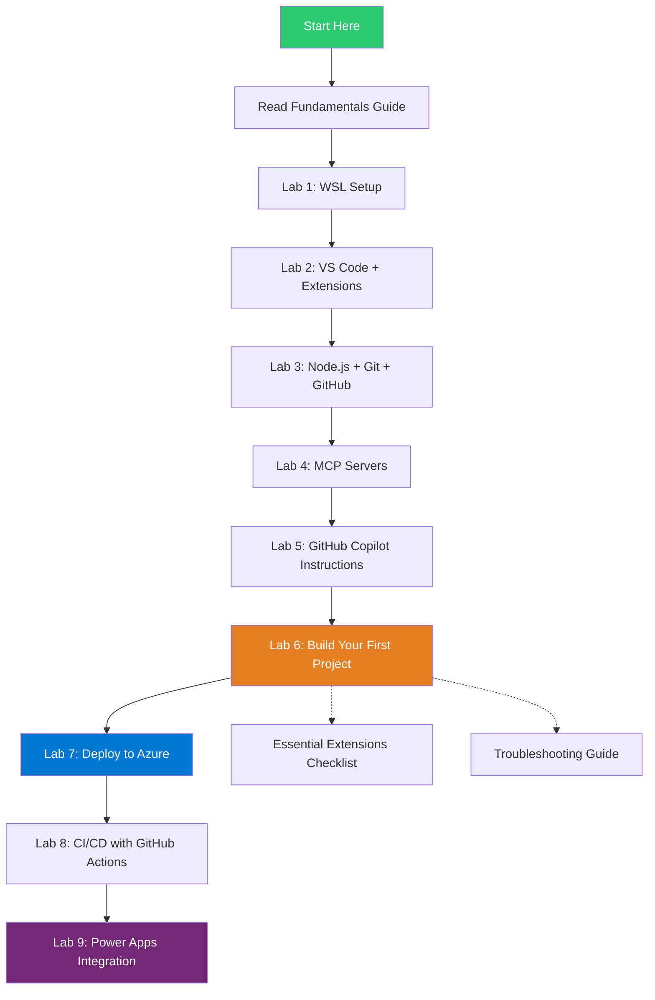

# Vibe Coding Lab — Complete Learning Framework

> **Purpose**: This document provides a comprehensive outline of the entire vibe coding learning path, showing how each lab builds on previous ones and what skills you'll develop.

---

## Framework Overview

---

## Target Audience

**Who this is for**:
- Non-developers who want to build apps using AI
- Business professionals learning to code with GitHub Copilot
- Windows users deploying to Azure

**Prerequisites**:
- Windows 10/11 computer
- Basic computer literacy (installing software, using web browsers)
- Willingness to learn new concepts
- No prior coding experience required

**Not required**:
- Programming knowledge
- Command-line experience
- Understanding of Git or cloud platforms

---

## Technology Stack

### Core Technologies
| Technology | Purpose | Version |
|-----------|---------|---------|
| **Windows 11** | Host operating system | Latest |
| **WSL 2 (Ubuntu)** | Linux development environment | Ubuntu 22.04 LTS |
| **VS Code Insiders** | Code editor | Latest preview |
| **GitHub Copilot** | AI code generation | Subscription required |
| **Node.js** | JavaScript runtime | v24 LTS |
| **TypeScript** | Type-safe JavaScript | v5.x |
| **React** | UI framework | v19 |
| **Vite** | Build tool | v6 |
| **Tailwind CSS** | Styling framework | v4 |

### Deployment & DevOps
| Technology | Purpose | Version |
|-----------|---------|---------|
| **Azure Static Web Apps** | Hosting platform | Latest |
| **GitHub Actions** | CI/CD pipeline | Latest |
| **Azure CLI** | Cloud management | v2.57+ |
| **Power Apps** | Low-code platform | Latest |

### Development Tools
| Technology | Purpose | Version |
|-----------|---------|---------|
| **Git** | Version control | v2.40+ |
| **GitHub** | Code hosting | Free account |
| **Microsoft Edge** | Browser DevTools | Latest |
| **SSH** | Secure authentication | Latest |

---

## Lab Breakdown

### 📖 Prerequisites (Before Lab 1)

**Document**: `vibe-coding-fundamentals.md`

**What you'll learn**:
- What vibe coding is and how it works
- GitHub Copilot modes: Ask, Agent, Beast, Plan
- VS Code terminology and interface
- Git & GitHub concepts
- TypeScript vs JavaScript comparison
- CI/CD pipeline basics
- Development environment fundamentals

**Time**: 30-45 minutes reading
**Outcome**: Conceptual foundation for all labs

---

### 🖥️ Lab 1: Install WSL 2 (Windows Subsystem for Linux)

**Goal**: Set up a Linux development environment on Windows

**What you'll do**:
1. Enable WSL feature in Windows
2. Install Ubuntu 22.04 from Microsoft Store
3. Set WSL 2 as default version
4. Create Linux user account
5. Update Ubuntu packages

**What you'll learn**:
- Why developers use Linux for coding
- How WSL bridges Windows and Linux
- Basic Linux terminal commands
- Package management with `apt`

**Technologies introduced**:
- WSL 2
- Ubuntu 22.04
- Windows Terminal

**Time**: 15-20 minutes
**Prerequisites**: Windows 10 (version 2004+) or Windows 11

**Checkpoint**:
- [ ] WSL 2 installed and running
- [ ] Ubuntu terminal opens successfully
- [ ] Can run `wsl --list --verbose` and see Ubuntu

---

### 🎨 Lab 2: Install VS Code Insiders and Essential Extensions

**Goal**: Set up your code editor with GitHub Copilot

**What you'll do**:
1. Install VS Code Insiders
2. Install WSL extension
3. Connect to Ubuntu from VS Code
4. Install GitHub Copilot extensions
5. Sign in to GitHub Copilot
6. Verify Copilot activation

**What you'll learn**:
- VS Code interface (Explorer, Editor, Terminal, Extensions)
- Difference between LOCAL and WSL extensions
- How GitHub Copilot integrates with VS Code
- Extension management

**Technologies introduced**:
- VS Code Insiders
- GitHub Copilot (Chat, Agent, Beast, Plan modes)
- Remote - WSL extension

**Time**: 20-25 minutes
**Prerequisites**: Lab 1 completed, GitHub Copilot subscription

**Checkpoint**:
- [ ] VS Code Insiders connected to WSL
- [ ] GitHub Copilot installed and activated
- [ ] Can open Copilot Chat with `Ctrl+Shift+I`
- [ ] Extensions showing in WSL: Ubuntu section

**Reference**: `essential-extensions-checklist.md`

---

### 🔧 Lab 3: Install Node.js, Git, and Set Up GitHub

**Goal**: Install development tools and configure GitHub authentication

**What you'll do**:
1. Install nvm (Node Version Manager)
2. Install Node.js v24 LTS via nvm
3. Install Git for version control
4. Configure Git identity (name, email)
5. Create or verify GitHub account
6. Generate SSH key for authentication
7. Add SSH key to GitHub
8. Test GitHub connection
9. Install Azure CLI
10. Install GitHub CLI (`gh`)

**What you'll learn**:
- Why use nvm instead of direct Node.js install
- Git configuration basics
- SSH key-based authentication
- GitHub account setup
- Command-line tool installation

**Technologies introduced**:
- nvm (Node Version Manager)
- Node.js v24 LTS
- npm (Node Package Manager)
- Git
- GitHub
- SSH keys
- Azure CLI
- GitHub CLI

**Time**: 30-35 minutes
**Prerequisites**: Lab 2 completed, GitHub account (free)

**Checkpoint**:
- [ ] `node --version` shows v24.x
- [ ] `git --version` shows v2.40+
- [ ] SSH key added to GitHub
- [ ] `ssh -T git@github.com` succeeds
- [ ] `az --version` shows Azure CLI
- [ ] `gh auth status` shows authenticated

---

### 🔌 Lab 4: Configure MCP Servers

**Goal**: Connect GitHub Copilot to external documentation and services

**What you'll do**:
1. Install Microsoft Learn MCP Server (remote HTTP server)
2. Configure Context7 MCP (library documentation)
3. Configure Azure MCP (cloud resource management)
4. Configure GitHub MCP (repository access)
5. Configure Playwright MCP (browser automation)
6. Generate GitHub Personal Access Token
7. Verify all MCP servers are running
8. Add custom instructions for Microsoft Learn MCP

**What you'll learn**:
- What MCP (Model Context Protocol) servers are
- How MCP servers enhance GitHub Copilot
- Difference between local and remote MCP servers
- GitHub token-based authentication

**Technologies introduced**:
- Microsoft Learn MCP Server (remote)
- Context7 MCP (`@upstash/context7-mcp`)
- Azure MCP (`@azure/mcp`)
- GitHub MCP (`@modelcontextprotocol/server-github`)
- Playwright MCP (`@playwright/mcp`)

**Time**: 25-30 minutes
**Prerequisites**: Lab 3 completed, GitHub account

**Checkpoint**:
- [ ] All 5 MCP servers configured
- [ ] Microsoft Learn MCP installed via Extensions
- [ ] GitHub token generated and saved
- [ ] MCP servers visible in Extensions panel
- [ ] Custom instructions added for Microsoft Learn

**Key Insight**: MCP servers give GitHub Copilot access to live documentation, making suggestions more accurate and up-to-date.

---

### 📝 Lab 5: Set Up GitHub Copilot Customization Files

**Goal**: Teach GitHub Copilot your project's standards and conventions

**What you'll do**:
1. Create `.github/` directory structure
2. Write `copilot-instructions.md` (project-wide guidance)
3. Create path-specific instruction files:
   - `typescript.instructions.md`
   - `vite.instructions.md`
   - `tailwindcss.instructions.md`
   - `azure.instructions.md`
   - `axios.instructions.md`
   - `github.instructions.md`
4. Create reusable prompt files:
   - `component.prompt.md` (React component template)
   - `api-service.prompt.md` (API service template)
   - `test.prompt.md` (Unit test template)

**What you'll learn**:
- How GitHub Copilot reads custom instructions
- Instruction hierarchy (personal → repository → path-specific → organization)
- Writing effective prompts for consistent code generation
- Project-specific conventions and standards

**Technologies introduced**:
- `.github/copilot-instructions.md`
- Path-specific `.instructions.md` files
- Reusable `.prompt.md` templates

**Time**: 20-25 minutes
**Prerequisites**: Lab 4 completed

**Checkpoint**:
- [ ] `.github/copilot-instructions.md` created
- [ ] All 6 path-specific instruction files created
- [ ] All 3 prompt templates created
- [ ] Instructions include TypeScript, React 19, Tailwind v4 standards

**Key Insight**: Custom instructions are what separate productive vibe coding from generic code generation. They ensure GitHub Copilot generates code that matches your project's style.

---

### 🚀 Lab 6: Vibe Code Your First Project

**Goal**: Build a complete React application using GitHub Copilot Agent Mode

**What you'll do**:
1. Scaffold Vite + React + TypeScript project
2. Install and configure Tailwind CSS v4
3. Set up environment variables
4. Use GitHub Copilot Agent Mode to build features
5. Iterate with conversational prompts
6. **Troubleshoot terminal errors with GitHub Copilot Chat**
7. **Debug runtime issues with Browser DevTools**
8. Test the application in the browser

**What you'll learn**:
- Vite project structure
- GitHub Copilot Agent Mode workflow
- How to write effective vibe coding prompts
- Iterative development with AI
- **Error troubleshooting workflow** (terminal → copy → paste into Copilot Chat)
- **Browser DevTools essentials**:
  - Console tab (JavaScript errors)
  - Network tab (API debugging)
  - Elements tab (CSS/HTML inspection)
  - Application tab (LocalStorage, cache)
- Keep vs Undo decision-making

**Technologies introduced**:
- Vite 6
- React 19 (functional components, hooks)
- TypeScript 5.x
- Tailwind CSS v4
- Axios (HTTP client)
- Vitest (testing)
- Microsoft Edge / Chrome DevTools

**Time**: 60-90 minutes
**Prerequisites**: Labs 1-5 completed

**Project Features Built**:
- Dashboard with header and sidebar
- Responsive navigation (mobile hamburger menu)
- API service fetching data from JSONPlaceholder
- Data displayed as cards
- Dark mode toggle (persisted to LocalStorage)
- Unit tests for components

**Checkpoint**:
- [ ] Vite + React + TypeScript project running
- [ ] Tailwind CSS v4 configured
- [ ] Multiple components built via GitHub Copilot Agent Mode
- [ ] API service fetching and displaying data
- [ ] Dark mode toggle working
- [ ] Tests passing
- [ ] Can use DevTools to debug issues
- [ ] App running on `localhost:5173`

**Key Insight**: This is where vibe coding comes alive. You describe features in natural language, GitHub Copilot generates the code, and you iterate through conversation.

---

### ☁️ Lab 7: Deploy to Azure Static Web Apps

**Goal**: Deploy your app to the cloud and make it publicly accessible

**What you'll do**:
1. Push code to GitHub repository
2. Create Azure resource group
3. Create Azure Static Web App
4. Link GitHub repo to Azure
5. Configure SPA routing (`staticwebapp.config.json`)
6. Verify deployment
7. Access live public URL

**What you'll learn**:
- Git workflow (add, commit, push)
- GitHub repository creation
- Azure resource organization
- Static web hosting
- SPA routing configuration
- Deployment verification

**Technologies introduced**:
- Azure Static Web Apps
- Azure Resource Groups
- `staticwebapp.config.json`

**Time**: 20-25 minutes
**Prerequisites**: Lab 6 completed, Azure account (free tier available)

**Checkpoint**:
- [ ] Code pushed to GitHub
- [ ] Azure Static Web App created
- [ ] App deployed and accessible via public URL
- [ ] SPA routing works correctly
- [ ] All features working in production

**Key Insight**: Azure Static Web Apps provides free hosting for frontend apps with automatic HTTPS and global CDN.

---

### 🔄 Lab 8: Set Up CI/CD with GitHub Actions

**Goal**: Automate testing and deployment on every code push

**What you'll do**:
1. Understand GitHub Actions workflow
2. Create `.github/workflows/azure-static-web-apps.yml`
3. Configure build and deployment steps
4. Add automated testing to pipeline
5. Push code to trigger workflow
6. Monitor workflow execution
7. Verify automatic deployment

**What you'll learn**:
- What CI/CD (Continuous Integration/Continuous Deployment) means
- GitHub Actions workflow syntax
- Automated testing and building
- Deployment automation
- Workflow monitoring and debugging

**Technologies introduced**:
- GitHub Actions
- YAML workflow syntax
- Automated CI/CD pipeline

**Time**: 20-25 minutes
**Prerequisites**: Lab 7 completed

**Checkpoint**:
- [ ] GitHub Actions workflow file created
- [ ] Workflow includes build and test steps
- [ ] Automatic deployment on push to `main` branch
- [ ] Can view workflow runs in GitHub Actions tab
- [ ] Deployments succeed automatically

**Key Insight**: CI/CD eliminates manual deployment steps. Push code → tests run automatically → deploys to Azure if tests pass.

---

### 🔌 Lab 9 (Optional): Publish as a Power Apps Code App

**Goal**: Integrate your React app into Microsoft Power Apps ecosystem

**What you'll do**:
1. Install Power Platform CLI (`pac`)
2. Authenticate to Power Platform
3. Initialize code app project structure
4. Configure app manifest
5. Build and package the app
6. Deploy to Power Apps environment
7. Test in Power Apps portal

**What you'll learn**:
- Power Apps code apps vs PCF components
- Power Platform CLI usage
- App manifest configuration
- Power Apps deployment process

**Technologies introduced**:
- Power Platform CLI (`pac`)
- Power Apps code apps
- Power Apps environment

**Time**: 30-35 minutes
**Prerequisites**: Lab 7 completed, Power Apps environment access

**Checkpoint**:
- [ ] `pac` CLI installed and authenticated
- [ ] Code app project initialized
- [ ] App manifest configured
- [ ] App built and packaged
- [ ] App deployed to Power Apps
- [ ] App accessible in Power Apps portal

**Key Insight**: Power Apps code apps let you integrate custom React applications into the Power Platform ecosystem, combining low-code and pro-code approaches.

---

## Learning Outcomes by Lab

### Foundation Tier (Labs 1-3)
**Time**: ~65-80 minutes
**Skills acquired**:
- ✅ Linux development environment setup
- ✅ Professional code editor proficiency
- ✅ GitHub Copilot activation and basic usage
- ✅ Version control fundamentals
- ✅ GitHub authentication
- ✅ Command-line confidence

### Enhancement Tier (Labs 4-5)
**Time**: ~45-55 minutes
**Skills acquired**:
- ✅ MCP server configuration
- ✅ GitHub Copilot customization
- ✅ Project-specific AI instruction writing
- ✅ Reusable prompt templates

### Application Tier (Lab 6)
**Time**: ~60-90 minutes
**Skills acquired**:
- ✅ **Vibe coding workflow mastery**
- ✅ **GitHub Copilot Agent Mode usage**
- ✅ React application development
- ✅ TypeScript fundamentals
- ✅ **Error troubleshooting with GitHub Copilot Chat**
- ✅ **Browser DevTools debugging** (Console, Network, Elements, Application tabs)
- ✅ Responsive design with Tailwind
- ✅ API integration
- ✅ Testing basics

### Deployment Tier (Labs 7-8)
**Time**: ~40-50 minutes
**Skills acquired**:
- ✅ Azure cloud deployment
- ✅ CI/CD pipeline creation
- ✅ Automated testing and deployment
- ✅ Production-ready configuration

### Integration Tier (Lab 9)
**Time**: ~30-35 minutes
**Skills acquired**:
- ✅ Power Platform integration
- ✅ Enterprise app deployment
- ✅ Low-code/pro-code hybrid approaches

---

## Total Time Investment

| Tier | Labs | Time | Cumulative |
|------|------|------|------------|
| **Prerequisites** | Fundamentals Guide | 30-45 min | 0:45 |
| **Foundation** | Labs 1-3 | 65-80 min | 2:05 |
| **Enhancement** | Labs 4-5 | 45-55 min | 3:00 |
| **Application** | Lab 6 | 60-90 min | 4:30 |
| **Deployment** | Labs 7-8 | 40-50 min | 5:20 |
| **Integration** | Lab 9 (Optional) | 30-35 min | 5:55 |

**Total**: ~5-6 hours for complete path (including optional Lab 9)
**Core path**: ~4.5-5 hours (Labs 1-8)

---

## Success Criteria

By the end of this learning path, you will be able to:

### ✅ Technical Skills
- [ ] Set up a complete development environment on Windows
- [ ] Use GitHub Copilot effectively (Ask, Agent, Beast, Plan modes)
- [ ] Build React applications using vibe coding
- [ ] Debug terminal errors with GitHub Copilot Chat
- [ ] Debug runtime issues with Browser DevTools
- [ ] Write TypeScript with confidence
- [ ] Style applications with Tailwind CSS
- [ ] Integrate APIs with Axios
- [ ] Write unit tests with Vitest
- [ ] Deploy applications to Azure
- [ ] Set up automated CI/CD pipelines
- [ ] Use Git for version control
- [ ] Navigate the command line comfortably

### ✅ Conceptual Understanding
- [ ] Understand how GitHub Copilot generates code
- [ ] Know when to use Ask vs Agent vs Beast vs Plan modes
- [ ] Recognize the difference between build errors and runtime errors
- [ ] Understand the development → deployment workflow
- [ ] Know how to troubleshoot using DevTools Console, Network, and Elements tabs
- [ ] Comprehend the role of MCP servers
- [ ] Understand CI/CD benefits and workflow
- [ ] Grasp TypeScript vs JavaScript trade-offs

### ✅ Workflow Proficiency
- [ ] Write effective vibe coding prompts
- [ ] Iterate with GitHub Copilot through conversation
- [ ] Review and approve/reject AI-generated code
- [ ] Troubleshoot errors systematically (terminal → Copilot, browser → DevTools)
- [ ] Test applications before deployment
- [ ] Push code to GitHub with confidence
- [ ] Monitor CI/CD pipeline execution

---

## Recommended Study Path

### For Complete Beginners
1. **Read fundamentals guide first** (30-45 min)
2. **Complete Labs 1-3 in one session** (1.5 hours)
   - Break after Lab 3 to practice Git commands
3. **Complete Labs 4-5 in one session** (1 hour)
   - Review custom instructions, make modifications
4. **Lab 6 as a separate focused session** (1.5 hours)
   - This is the most important lab — take your time
   - Experiment with different prompts
   - Practice troubleshooting with DevTools
5. **Labs 7-8 in one session** (1 hour)
   - Deployment and automation
6. **Lab 9 optional** — only if using Power Apps

**Total time**: ~5-6 hours spread over 4-5 sessions

### For Developers New to GitHub Copilot
1. **Skim fundamentals guide** (15 min) — focus on GitHub Copilot modes
2. **Skip Labs 1-3** if you already have WSL, VS Code, Node.js, Git
3. **Start with Lab 4** (MCP servers) → straight to Lab 5 (instructions)
4. **Focus heavily on Lab 6** — learn vibe coding workflow
5. **Labs 7-9** if needed for Azure/Power Apps

**Total time**: ~2-3 hours

### For Power Platform Developers
1. **Read fundamentals guide** (focus on GitHub Copilot concepts)
2. **Complete Labs 1-5** (setup and configuration)
3. **Lab 6** — learn vibe coding approach
4. **Lab 9** — integrate with Power Apps
5. **Skip Labs 7-8** if not deploying to Azure

**Total time**: ~4 hours

---

## Common Pitfalls and How to Avoid Them

### ❌ Skipping the Fundamentals Guide
**Problem**: Jumping straight to Lab 1 without understanding concepts
**Solution**: Spend 30-45 minutes reading `vibe-coding-fundamentals.md` first

### ❌ Installing Extensions in LOCAL Instead of WSL
**Problem**: Extensions not available when coding
**Solution**: Always verify extensions show in "WSL: UBUNTU - INSTALLED" section

### ❌ Not Customizing GitHub Copilot Instructions
**Problem**: GitHub Copilot generates inconsistent or low-quality code
**Solution**: Complete Lab 5 before Lab 6, customize instructions for your project

### ❌ Accepting All GitHub Copilot Suggestions Without Review
**Problem**: Bugs and security issues slip into codebase
**Solution**: Always review "Keep vs Undo" changes, test generated code

### ❌ Ignoring Browser DevTools
**Problem**: Spending hours debugging when DevTools Console shows the exact error
**Solution**: Open DevTools (`F12`) whenever something doesn't work in the browser

### ❌ Not Using GitHub Copilot Chat for Errors
**Problem**: Manually searching Stack Overflow for error solutions
**Solution**: Copy error → paste into GitHub Copilot Chat → get contextual fix

### ❌ Skipping Tests
**Problem**: Deploying broken code to production
**Solution**: Run `npm run test` before pushing, add tests to CI/CD pipeline

---

## Support Resources

### 📚 Documentation Files
- **vibe-coding-fundamentals.md** — Core concepts and terminology
- **vibe-coding-lab.md** — Step-by-step lab instructions
- **essential-extensions-checklist.md** — VS Code extension verification
- **youtube-transcript.md** — Video walkthrough script (for creating tutorials)
- **README.md** — Project overview

### 🌐 External Resources
- [GitHub Copilot Documentation](https://docs.github.com/copilot)
- [Microsoft Learn - MCP Server](https://learn.microsoft.com/training/support/mcp)
- [Azure Static Web Apps Documentation](https://learn.microsoft.com/azure/static-web-apps/)
- [Vite Documentation](https://vitejs.dev/)
- [React Documentation](https://react.dev/)
- [Tailwind CSS v4 Documentation](https://tailwindcss.com/docs)
- [TypeScript Handbook](https://www.typescriptlang.org/docs/)

### 🔧 Troubleshooting
- **Terminal errors**: Copy → paste into GitHub Copilot Chat
- **Runtime errors**: F12 → Console tab → copy error → paste into GitHub Copilot Chat
- **API issues**: F12 → Network tab → inspect request/response
- **Styling issues**: F12 → Elements tab → inspect CSS
- **Extension issues**: See `essential-extensions-checklist.md`

---

## Next Steps After Completion

### 🚀 Level Up Your Skills
1. **Build more complex apps** — E-commerce site, task manager, blog platform
2. **Learn GitHub Copilot Beast Mode** — Rapid prototyping techniques
3. **Master GitHub Copilot Plan Mode** — Complex feature planning
4. **Explore advanced Tailwind** — Custom themes, animations, transitions
5. **Add backend API** — Node.js + Express + PostgreSQL
6. **Implement authentication** — Auth0, Firebase Auth, Azure AD B2C
7. **Advanced testing** — E2E tests with Playwright, integration tests
8. **Performance optimization** — React.memo, lazy loading, code splitting

### 🌟 Real-World Projects
- Personal portfolio website
- Business landing page with contact form
- Dashboard for data visualization
- Blog with CMS integration
- E-commerce product catalog
- Weather app with external API
- Task management app (Trello clone)
- Chat application with real-time updates

### 📖 Advanced Topics
- Server-side rendering (Next.js)
- GraphQL instead of REST
- State management (Zustand, Redux)
- Monorepos with Nx or Turborepo
- Docker containerization
- Kubernetes deployment
- Azure Functions (serverless)

---

## Feedback and Contributions

This learning framework is designed to evolve. If you:
- Find unclear instructions
- Discover better approaches
- Identify missing topics
- Have suggestions for improvement

Please provide feedback so this resource can improve for future learners.

---

**Last Updated**: February 15, 2026
**Framework Version**: 1.0
**Target Audience**: Non-developers learning vibe coding with GitHub Copilot on Windows, deploying to Azure
**Total Labs**: 9 (8 core + 1 optional)
**Estimated Completion Time**: 5-6 hours
