# Vibe Coding Fundamentals & Terminology Guide

> **Purpose**: This guide explains all the key concepts, tools, and terminology you'll encounter in the vibe coding lab. Read this before starting Lab 1 to build your foundational knowledge.

---

## Table of Contents

1. [What is Vibe Coding?](#what-is-vibe-coding)
2. [Core Concepts](#core-concepts)
3. [VS Code Terminology](#vs-code-terminology)
4. [GitHub Copilot Concepts](#github-copilot-concepts)
5. [Git & GitHub Terminology](#git--github-terminology)
6. [CI/CD Pipeline Terms](#cicd-pipeline-terms)
7. [Development Environment Terms](#development-environment-terms)
8. [Web Development Basics](#web-development-basics)
9. [Cloud & Deployment Terms](#cloud--deployment-terms)

---

## What is Vibe Coding?

**Vibe coding** is a development approach where you describe what you want to build in natural language, and AI (like GitHub Copilot) generates the code for you. Instead of typing code manually, you:

1. **Describe** your intent ("Create a dashboard with user profile cards")
2. **Review** the AI-generated code
3. **Iterate** by providing feedback ("Make the cards blue instead of gray")
4. **Test** the results in your browser

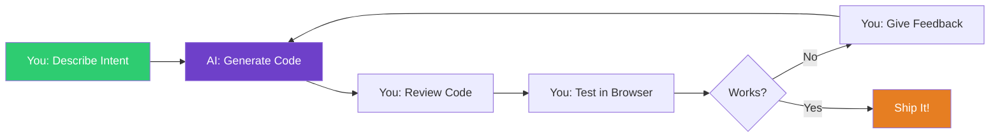

### Traditional Coding vs. Vibe Coding

| Traditional Coding | Vibe Coding |
|---|---|
| You write every line of code manually | AI writes code based on your descriptions |
| Years of learning syntax required | Focus on describing what you want |
|ググググ→ Stack Overflow → Copy code | Explain in plain English |
| Slow iteration cycles | Rapid prototyping and iteration |
| Must remember APIs and patterns | AI suggests patterns from training data |

**Important**: You still need to **read and understand** the generated code. You're the architect—AI is your junior developer.

---

## Core Concepts

### Agent Mode vs. Chat Mode

GitHub Copilot has two primary interaction modes:

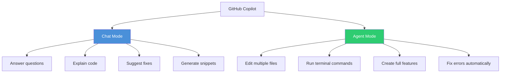

**Chat Mode**: Ask questions, get code snippets, receive explanations
**Agent Mode**: Describe a feature, Copilot autonomously implements it across files

### The Development Loop

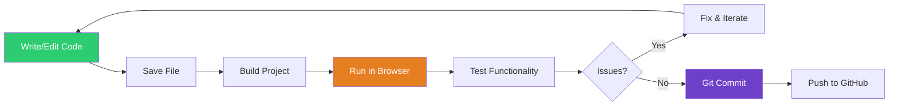

---

## VS Code Terminology

### The Interface

```
┌─────────────────────────────────────────────────────────┐
│  File  Edit  Selection  View  Go  Run  Terminal  Help  │ ← Menu Bar
├───┬─────────────────────────────────────────────────┬───┤
│ E │                                                 │ C │
│ x │          Editor Area                            │ o │
│ p │          (Where you write code)                 │ p │
│ l │                                                 │ i │
│ o │                                                 │ l │
│ r │                                                 │ o │
│ e │                                                 │ t │
│ r │                                                 │   │
│   │                                                 │ C │
│ S │                                                 │ h │
│ i │                                                 │ a │
│ d │                                                 │ t │
│ e │                                                 │   │
│ b │─────────────────────────────────────────────────│───│
│ a │          Terminal / Output Panel                │   │
│ r │          (Command line and logs)                │   │
└───┴─────────────────────────────────────────────────┴───┘
  ↑                                                      ↑
File Tree                                          Copilot Chat
Extensions                                         GitHub Integration
Search                                             Debugger
Source Control
```

### Key VS Code Terms

| Term | What It Means | Example |
|------|---------------|---------|
| **Workspace** | The folder containing your project files | `my-vibe-app/` |
| **Explorer** | File tree sidebar showing all project files | Left panel with folders/files |
| **Editor** | The main area where you write code | Center panel with tabs |
| **Terminal** | Command-line interface built into VS Code | Bottom panel for running commands |
| **Extension** | Add-on that gives VS Code new capabilities | GitHub Copilot, ESLint, Prettier |
| **Command Palette** | Search menu for all VS Code commands (Ctrl+Shift+P) | "Git: Commit", "Format Document" |
| **IntelliSense** | Auto-complete suggestions as you type | Type `con` → suggests `console.log` |
| **Snippet** | Reusable code template | Type `for` → expands to full for-loop |

### Important Keyboard Shortcuts

| Shortcut | Action | When to Use |
|----------|--------|-------------|
| `Ctrl+Shift+P` | Open Command Palette | Run any VS Code command |
| `Ctrl+`` | Toggle terminal | Open/close command line |
| `Ctrl+Shift+I` | Open Copilot Chat | Ask AI for help |
| `Ctrl+I` | Inline Copilot | Edit code in place with AI |
| `Ctrl+S` | Save file | Save your changes |
| `Ctrl+P` | Quick file open | Jump to a file by name |
| `Ctrl+Shift+F` | Search across files | Find text in entire project |
| `Ctrl+/` | Toggle comment | Comment/uncomment selected code |

**Screenshot Placeholder**: *VS Code interface with labeled sections*

---

## GitHub Copilot Concepts

### How Copilot Works

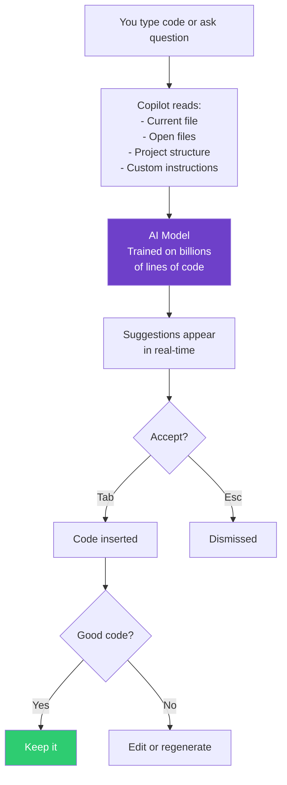

### Copilot Modes & Features

| Feature | What It Does | How to Access |
|---------|-------------|---------------|
| **Inline Completions** | Suggests code as you type | Appears automatically (gray text) |
| **Chat Mode** | Conversational AI help | `Ctrl+Shift+I` or click chat icon |
| **Agent Mode** | Autonomous multi-file editing | Switch mode in Copilot Chat dropdown |
| **Slash Commands** | Quick actions like `/explain`, `/fix` | Type `/` in Copilot Chat |
| **Custom Instructions** | Project-specific guidance for AI | `.github/copilot-instructions.md` |
| **Prompt Files** | Reusable command templates | `.github/prompts/*.prompt.md` |

### Custom Instructions Hierarchy

Copilot reads instructions in this priority order:

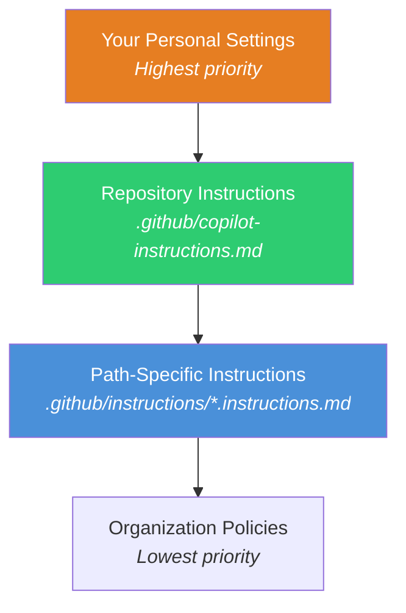

**Example**: If you tell Copilot "always use functional components" in your personal settings, and the repository says "use class components," Copilot follows *your* personal preference.

### Understanding MCP Servers

**MCP (Model Context Protocol)** servers are plugins that give Copilot access to external tools and services.

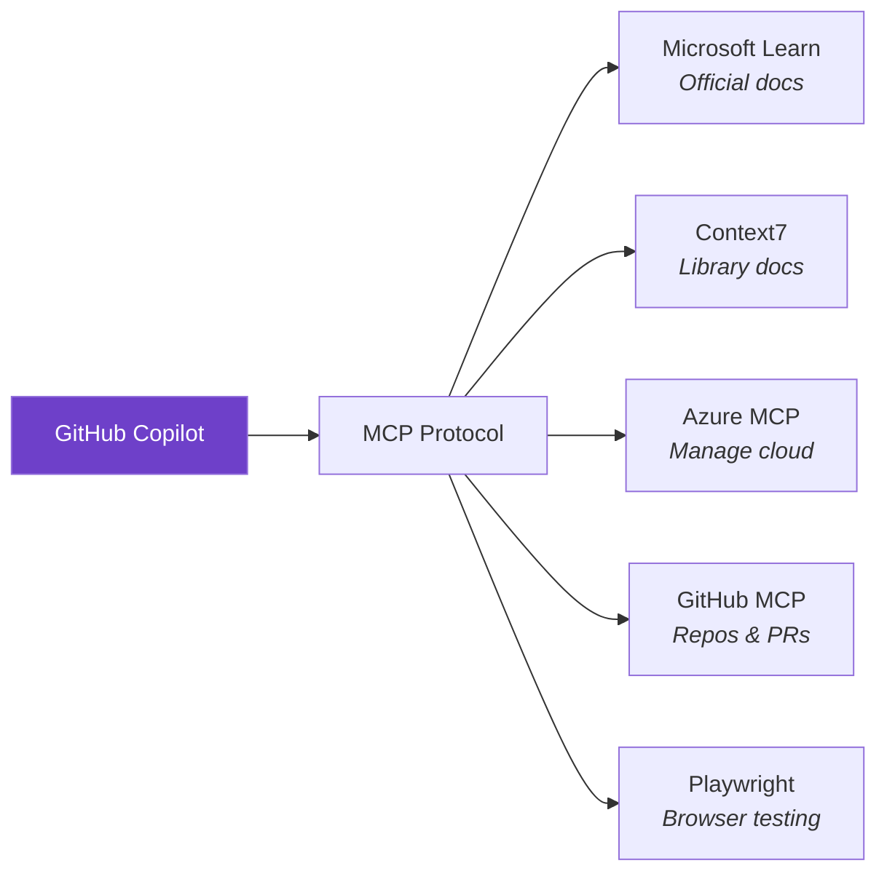

Think of MCP servers as Copilot's "tools":
- Without MCP: Copilot only knows what you type and what it was trained on
- With MCP: Copilot can fetch live docs, manage Azure resources, read your GitHub repos, etc.

---

## Git & GitHub Terminology

### What is Git?

**Git** is version control software that tracks changes to your code over time. Think of it like "Track Changes" in Microsoft Word, but for entire projects.

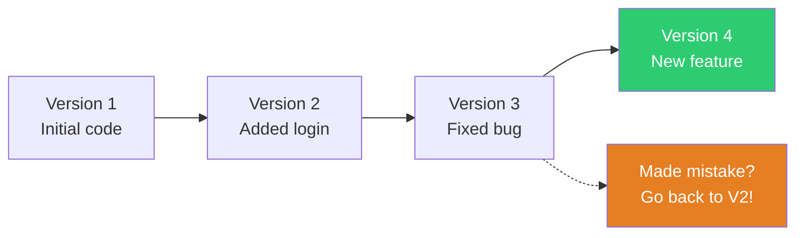

### GitHub vs. Git

| Git | GitHub |
|-----|--------|
| Software on your computer | Website (github.com) |
| Tracks changes locally | Stores code in the cloud |
| Works offline | Requires internet |
| Command-line tool | Web interface + collaboration |

Think of it like:
- **Git** = Microsoft Word's save/undo features
- **GitHub** = OneDrive where you back up and share Word docs

### Key Git Terms

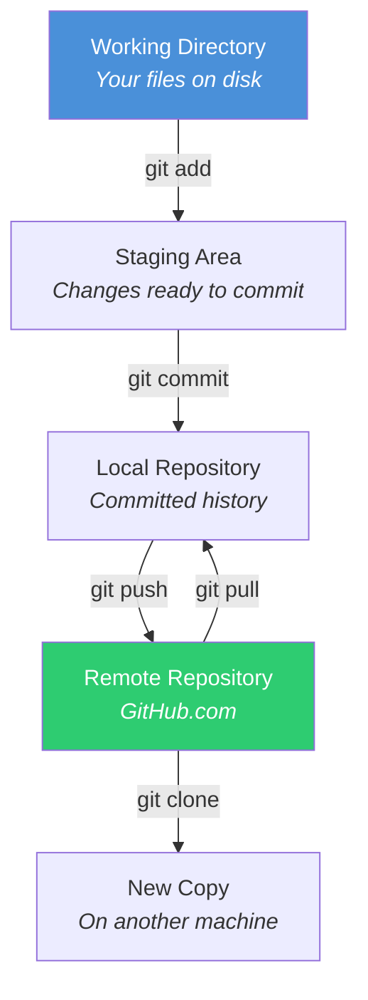

| Term | Definition | Command Example |
|------|-----------|-----------------|
| **Repository (Repo)** | A project folder tracked by Git | `git init` creates one |
| **Commit** | A snapshot of your code at a point in time | `git commit -m "Add login"` |
| **Branch** | A parallel version of your code | `git branch feature-login` |
| **main/master** | The primary branch (default) | Auto-created |
| **Staging** | Marking files to include in next commit | `git add myfile.js` |
| **Push** | Send commits to GitHub | `git push` |
| **Pull** | Get latest code from GitHub | `git pull` |
| **Clone** | Download a repository from GitHub | `git clone https://...` |
| **Fork** | Copy someone else's repo to your account | Click "Fork" on GitHub |
| **Pull Request (PR)** | Propose changes to a repository | Created on GitHub.com |
| **Merge** | Combine two branches | `git merge feature-login` |

### Git Workflow

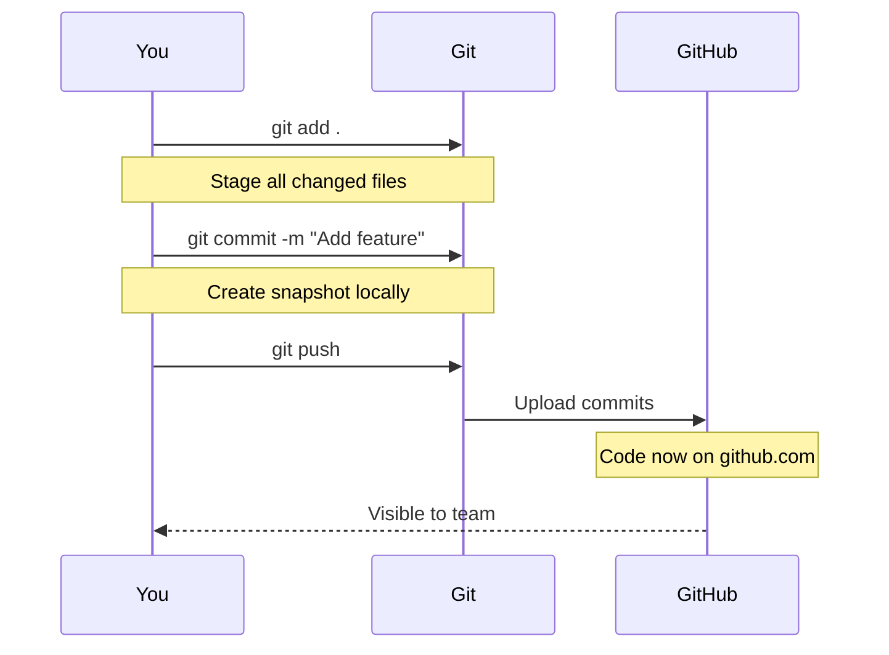

**Screenshot Placeholder**: *GitHub interface showing repository, commits, and branches*

---

## CI/CD Pipeline Terms

### What is CI/CD?

**CI/CD** stands for **Continuous Integration / Continuous Deployment**. It's automation that tests and deploys your code every time you push changes.

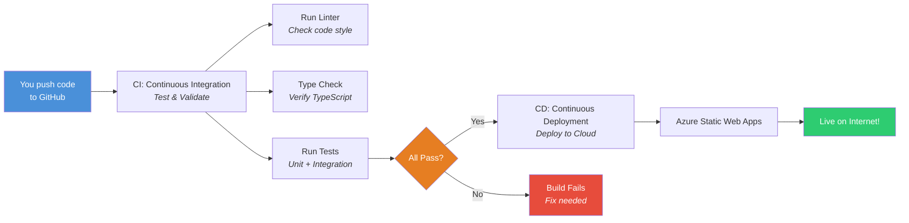

### CI/CD Vocabulary

| Term | What It Means | Example |
|------|---------------|---------|
| **Pipeline** | Automated sequence of steps | Lint → Test → Build → Deploy |
| **Build** | Compile your code for production | `npm run build` |
| **Artifact** | Output files from a build | `dist/` folder with compiled code |
| **Job** | A set of steps in a pipeline | "test" job, "deploy" job |
| **Workflow** | The entire CI/CD process | GitHub Actions `.yml` file |
| **Trigger** | Event that starts a pipeline | Push to `main` branch |
| **Runner** | Server that executes pipeline steps | GitHub's cloud servers |
| **Environment** | Deployment target | `production`, `staging`, `dev` |
| **Gate** | Checkpoint that must pass | Tests must pass before deploy |
| **Rollback** | Revert to previous version | If new deploy breaks |

### GitHub Actions Components

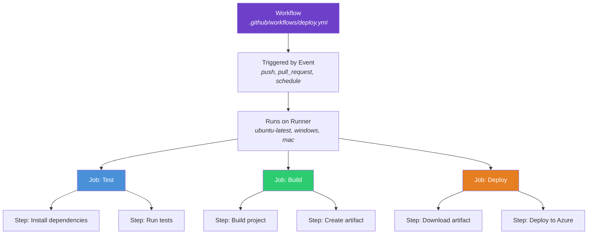

**Example Workflow**:

```yaml
name: Deploy to Azure

on:
  push:
    branches: [main]  # Trigger: push to main branch

jobs:
  test:  # Job 1
    runs-on: ubuntu-latest  # Runner
    steps:
      - uses: actions/checkout@v3  # Step: Get code
      - run: npm install           # Step: Install deps
      - run: npm test              # Step: Run tests

  deploy:  # Job 2 (runs after test passes)
    needs: test
    runs-on: ubuntu-latest
    steps:
      - run: npm run build
      - run: az staticwebapp deploy  # Deploy to Azure
```

**Screenshot Placeholder**: *GitHub Actions workflow run showing green checkmarks for passing steps*

---

## Development Environment Terms

### Terminal / Command Line

The **terminal** (also called **command line** or **shell**) is a text interface for running commands on your computer.

```
$ npm install        ← You type this
... installing...    ← Output appears
Done!
```

| Term | Definition |
|------|------------|
| **Shell** | The program interpreting your commands (Bash, Zsh, PowerShell) |
| **Bash** | Linux/Mac default shell |
| **PowerShell** | Windows shell |
| **WSL** | Windows Subsystem for Linux (Linux shell on Windows) |
| **Command** | An instruction you type (`ls`, `cd`, `npm install`) |
| **Flag/Option** | Modifies a command (`-y`, `--save`, `--version`) |
| **Path** | File location (`/home/user/project/file.js`) |
| **Current Directory** | Folder you're "in" right now (`pwd` shows it) |
| **Root Directory** | Top-level folder (`/` on Linux, `C:\` on Windows) |

### Common Commands

```bash
# Navigate
cd my-app          # Change directory
ls                 # List files
pwd                # Print working directory

# File operations
mkdir new-folder   # Make directory
rm file.txt        # Remove file
cp old.txt new.txt # Copy file
mv old.txt new.txt # Move/rename file

# Node.js / npm
npm install        # Install dependencies
npm run dev        # Start dev server
npm run build      # Build for production
node script.js     # Run JavaScript file

# Git
git status         # Show changed files
git add .          # Stage all changes
git commit -m "msg"# Create commit
git push           # Push to GitHub
```

### WSL (Windows Subsystem for Linux)

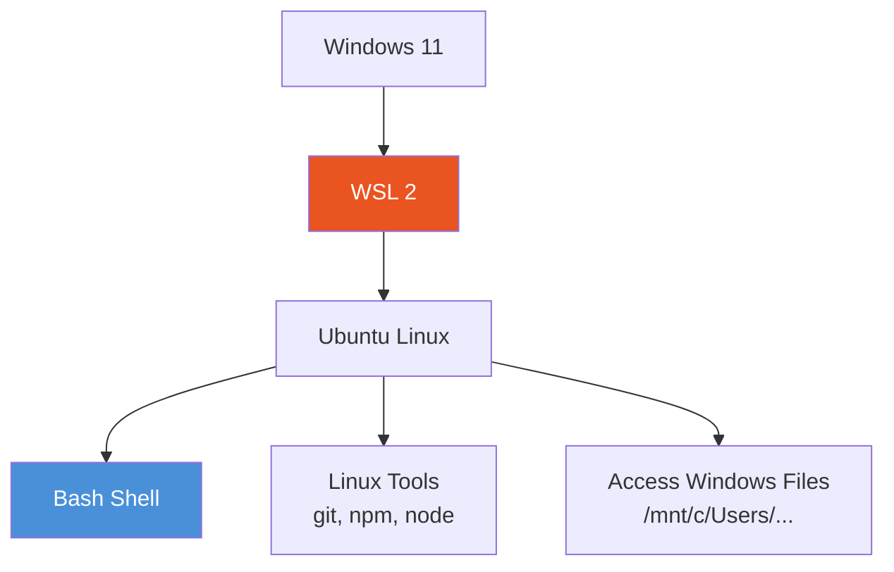

**Why WSL?**
- Professional developers use Linux/Mac
- Better compatibility with Node.js tools
- Faster file operations
- You get Linux power without dual-boot

---

## Web Development Basics

### Frontend vs. Backend

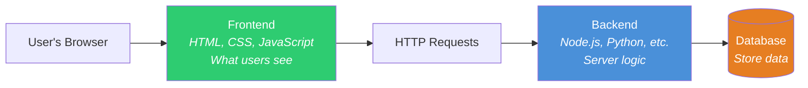

| | Frontend | Backend |
|---|----------|---------|
| **Runs** | In user's browser | On a server |
| **Languages** | HTML, CSS, JavaScript | Node.js, Python, C#, etc. |
| **Purpose** | User interface | Business logic, data |
| **Examples** | Buttons, forms, animations | Login, payments, database |

**This lab focuses on**: Frontend only (Vite + React + TypeScript)

### Key Technologies in This Lab

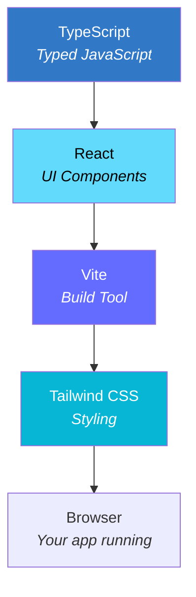

| Technology | What It Does | Why We Use It |
|------------|--------------|---------------|
| **TypeScript** | JavaScript with types (catches errors early) | Prevents bugs, better autocomplete |
| **React** | Build UIs with reusable components | Industry standard, huge ecosystem |
| **Vite** | Fast build tool and dev server | Instant hot reload, optimized builds |
| **Tailwind CSS** | Utility-first CSS framework | No custom CSS, just add classes |
| **Axios** | HTTP client for API calls | Cleaner than `fetch()` |

### How a React App Works

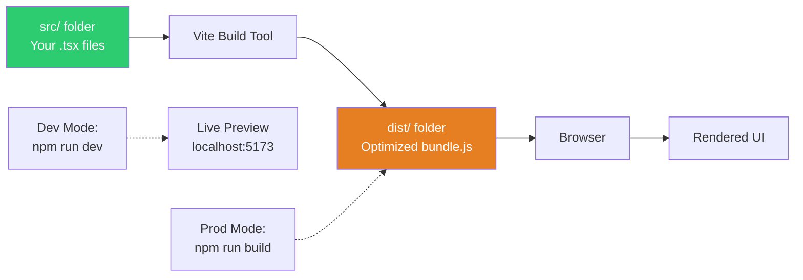

**Development**: Files auto-reload when you save
**Production**: Minified, optimized for speed

---

## Cloud & Deployment Terms

### What is "The Cloud"?

The **cloud** just means "someone else's computer" — servers you rent to run your app.

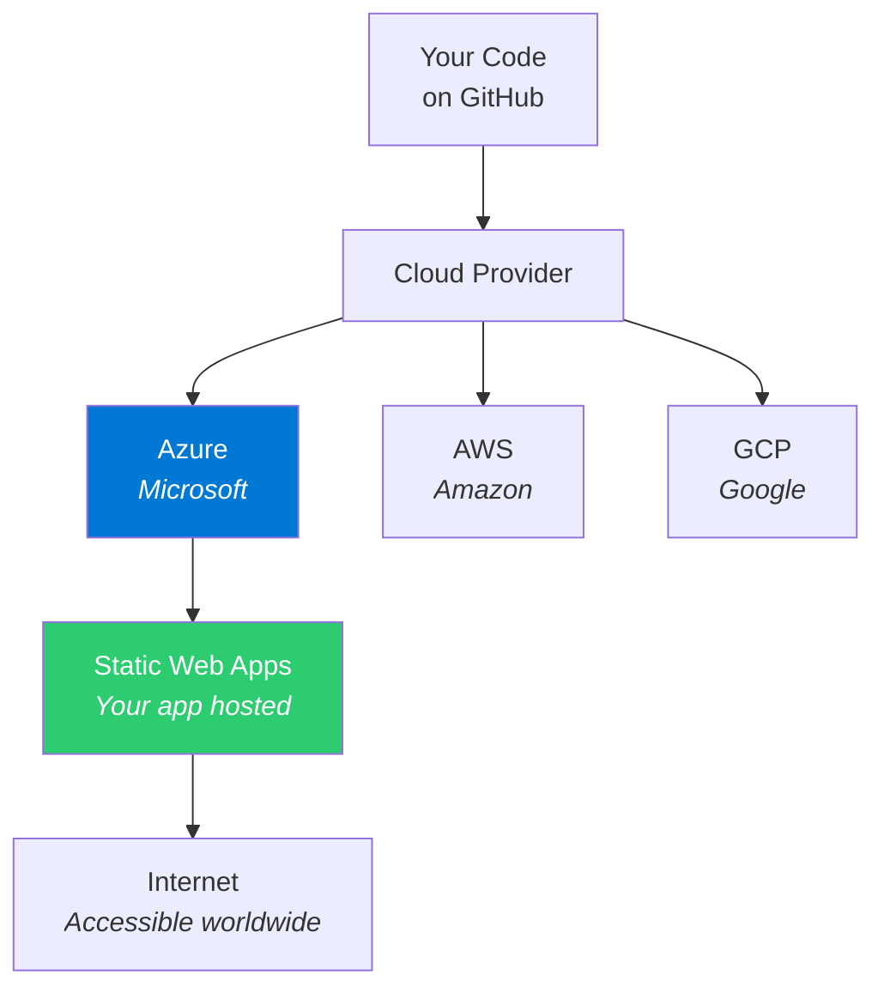

### Azure Terminology

| Term | What It Means |
|------|---------------|
| **Azure** | Microsoft's cloud platform |
| **Static Web App** | Hosting for frontend apps (HTML/JS/CSS) |
| **Resource Group** | Container for related cloud resources |
| **Subscription** | Your billing account |
| **Environment** | Deployment target (dev, staging, production) |
| **Custom Domain** | Your own URL (myapp.com vs. myapp.azurestaticapps.net) |

### Deployment Process

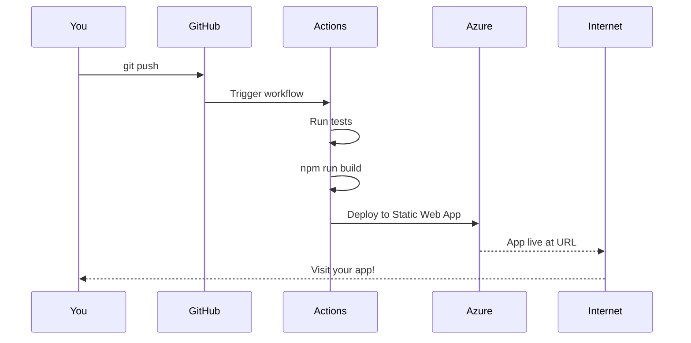

---

## Quick Reference: Common Acronyms

| Acronym | Full Name | What It Means |
|---------|-----------|---------------|
| **AI** | Artificial Intelligence | Computer programs that learn and adapt |
| **API** | Application Programming Interface | How programs talk to each other |
| **CLI** | Command Line Interface | Text-based way to run commands |
| **CI/CD** | Continuous Integration/Deployment | Automated testing and deployment |
| **CSS** | Cascading Style Sheets | Language for styling web pages |
| **DOM** | Document Object Model | Browser's representation of web page |
| **HTML** | HyperText Markup Language | Structure of web pages |
| **HTTP** | HyperText Transfer Protocol | How browsers request web pages |
| **IDE** | Integrated Development Environment | Code editor with extra tools |
| **JSON** | JavaScript Object Notation | Data format (like XML but simpler) |
| **LTS** | Long Term Support | Stable version maintained for years |
| **MCP** | Model Context Protocol | Plugin system for AI assistants |
| **NPM** | Node Package Manager | Tool to install JavaScript libraries |
| **PR** | Pull Request | Propose code changes on GitHub |
| **SDK** | Software Development Kit | Tools to build with a platform |
| **SPA** | Single Page Application | Web app that doesn't reload pages |
| **SSH** | Secure Shell | Encrypted connection to remote computers |
| **UI/UX** | User Interface / User Experience | How apps look and feel |
| **URL** | Uniform Resource Locator | Web address (https://...) |
| **VM** | Virtual Machine | Simulated computer inside your computer |
| **WSL** | Windows Subsystem for Linux | Linux environment on Windows |
| **YAML** | YAML Ain't Markup Language | Configuration file format |

---

## Visual Learning: The Complete Picture

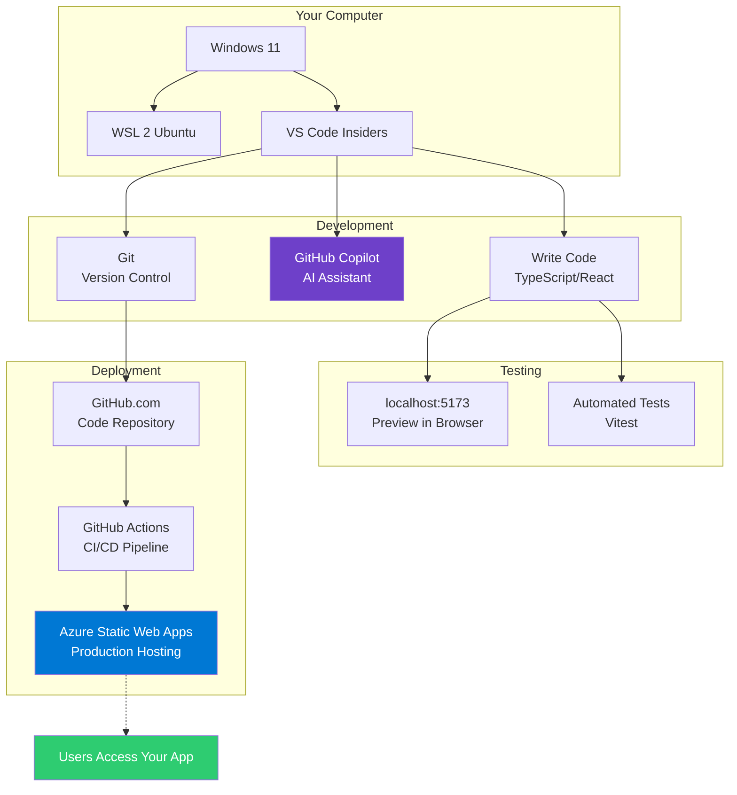

---

## Next Steps

Now that you understand the fundamentals, you're ready to start **Lab 1: Install WSL 2**.

**Pro Tip**: Keep this guide open in a browser tab as you work through the labs. Ctrl+F to search for any term you don't recognize!

---

*Last updated: February 2026*
