# Vibe Coding in TypeScript: A Hands-On Lab

> **Audience**: Non-developer professionals ready to build real applications using AI-assisted coding
> **Duration**: ~4 hours (self-paced)
> **Outcome**: A fully configured development environment with GitHub Copilot, custom AI instructions, MCP servers, and a deployed sample app on Azure

---

## Lab Architecture Overview

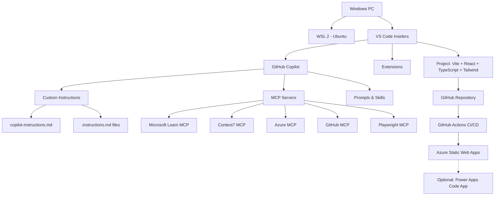

---

## Lab Roadmap

```mermaid
graph LR
    L1[Lab 1<br/>Environment Setup] --> L2[Lab 2<br/>VS Code & Extensions]
    L2 --> L3[Lab 3<br/>GitHub Account & Git]
    L3 --> L4[Lab 4<br/>MCP Servers]
    L4 --> L5[Lab 5<br/>Copilot Customization]
    L5 --> L6[Lab 6<br/>Vibe Code a Project]
    L6 --> L7[Lab 7<br/>Deploy to Azure]
    L7 --> L8[Lab 8<br/>CI/CD with Actions]
    L8 -.-> L9[Optional Lab 9<br/>Power Apps Code App]

    style L1 fill:#4A90D9,color:#fff
    style L2 fill:#4A90D9,color:#fff
    style L3 fill:#4A90D9,color:#fff
    style L4 fill:#7B68EE,color:#fff
    style L5 fill:#7B68EE,color:#fff
    style L6 fill:#2ECC71,color:#fff
    style L7 fill:#E67E22,color:#fff
    style L8 fill:#E67E22,color:#fff
    style L9 fill:#95A5A6,color:#fff
```

---

## Lab 1: Install WSL 2 (Windows Subsystem for Linux)

WSL gives you a full Linux terminal inside Windows, which is the standard environment professional developers use for web projects.

### Prerequisites

- Windows 11, or Windows 10 version 2004+ (Build 19041+)
- Virtualization enabled in BIOS/UEFI
- Administrator access to Windows Terminal / PowerShell

### Why WSL?

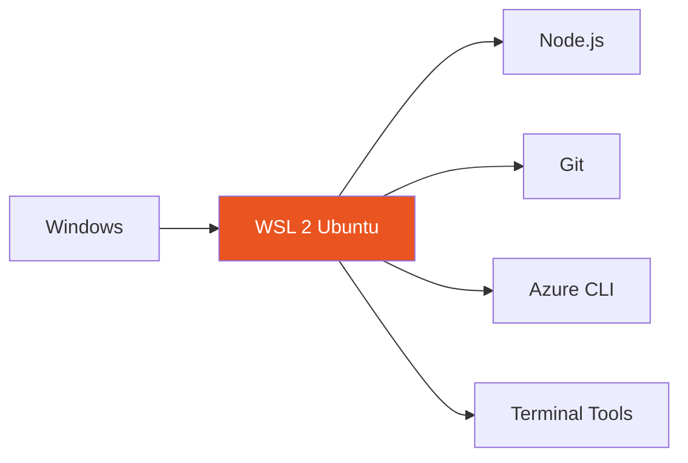

### Step 1.1: Enable WSL

Open **PowerShell as Administrator** (right-click the Start button, select "Terminal (Admin)") and run:

```powershell
wsl --install
```

This single command enables WSL 2 and installs Ubuntu. When it finishes, **restart your computer**.

### Step 1.2: Set Up Ubuntu

After restarting, Ubuntu will launch automatically and ask you to create a username and password. Pick something simple you'll remember — this is your Linux account, separate from your Windows login.

```
Enter new UNIX username: russ
New password: ********
```

### Step 1.3: Update Ubuntu Packages

Inside the Ubuntu terminal that opened:

```bash
sudo apt update && sudo apt upgrade -y
```

### Step 1.4: Verify WSL Version

Back in PowerShell:

```powershell
wsl --list --verbose
```

You should see your distro listed with **VERSION 2**. If it shows version 1, copy the distro name exactly from the output and run:

```powershell
wsl --set-version <DistroName> 2
```

Optional health checks:

```powershell
wsl --status
wsl --update
```

### Checkpoint

```
You should now have:
[x] WSL 2 enabled
[x] Ubuntu installed and running
[x] A Linux username and password set
```

### Optional: Automated Validation (Great for Windows 11 VM Testing)

From the repo root in PowerShell:

```powershell
powershell -ExecutionPolicy Bypass -File .\scripts\validate-wsl.ps1 -RunWslUpdate
```

To install core dev tools and run end-to-end scriptable checks for Labs 1-3 (WSL, VS Code Insiders, Node via nvm, Git, Azure CLI, GitHub CLI):

```powershell
powershell -ExecutionPolicy Bypass -File .\scripts\validate-wsl.ps1 -InstallDevTools -RunWslUpdate -TestAptUpdate
```

To also test package index refresh inside Linux:

```powershell
powershell -ExecutionPolicy Bypass -File .\scripts\validate-wsl.ps1 -RunWslUpdate -TestAptUpdate
```

Optional: install VS Code extension IDs from Lab 2 in automation mode:

```powershell
powershell -ExecutionPolicy Bypass -File .\scripts\validate-wsl.ps1 -InstallDevTools -InstallExtensions
```

Note: interactive sign-ins (`GitHub Copilot`, `az login`, `gh auth login`) and adding SSH keys to GitHub are reported as manual checkpoints because they require browser/UI interaction.

---

## Lab 2: Install VS Code Insiders and Essential Extensions

VS Code Insiders is the preview version of Visual Studio Code that receives GitHub Copilot features weeks before the stable release.

### Step 2.1: Download and Install VS Code Insiders

Visit: **https://code.visualstudio.com/insiders/**

Download the Windows installer and run it. During installation, check these boxes:

- [x] Add "Open with Code - Insiders" to the file context menu
- [x] Add "Open with Code - Insiders" to the directory context menu
- [x] Add to PATH

### Step 2.2: Connect VS Code Insiders to WSL

Open VS Code Insiders. Press `Ctrl+Shift+P` to open the Command Palette, then type:

```
WSL: Connect to WSL
```

Select it. VS Code will install its server component inside Ubuntu. The bottom-left corner should now display **WSL: Ubuntu**.

### Step 2.3: Install Required Extensions

Open the Extensions panel (`Ctrl+Shift+X`) and install each of these:

```mermaid
graph TD
    EXT[Required Extensions] --> A[GitHub Copilot<br/><i>AI pair programmer</i>]
    EXT --> B[GitHub Copilot Chat<br/><i>Conversational AI coding</i>]
    EXT --> C[WSL<br/><i>Develop in Linux from Windows</i>]
    EXT --> D[GitHub Pull Requests<br/><i>Review PRs inside VS Code</i>]
    EXT --> E[Azure Tools<br/><i>Azure resource management</i>]
    EXT --> F[GitHub Copilot for Azure<br/><i>Azure-aware AI assistance</i>]
    EXT --> G[ESLint<br/><i>JavaScript/TypeScript linting</i>]
    EXT --> H[Prettier<br/><i>Code formatting</i>]
    EXT --> I[Tailwind CSS IntelliSense<br/><i>Tailwind class autocomplete</i>]
    EXT --> J[Vite<br/><i>Vite dev server integration</i>]

    style A fill:#6e40c9,color:#fff
    style B fill:#6e40c9,color:#fff
    style F fill:#0078D4,color:#fff
    style E fill:#0078D4,color:#fff
```

**Extension IDs for quick install** — run these in the VS Code terminal (`Ctrl+``):

```bash
code-insiders --install-extension GitHub.copilot
code-insiders --install-extension GitHub.copilot-chat
code-insiders --install-extension ms-vscode-remote.remote-wsl
code-insiders --install-extension GitHub.vscode-pull-request-github
code-insiders --install-extension ms-vscode.vscode-node-azure-pack
code-insiders --install-extension ms-azuretools.vscode-azure-github-copilot
code-insiders --install-extension dbaeumer.vscode-eslint
code-insiders --install-extension esbenp.prettier-vscode
code-insiders --install-extension bradlc.vscode-tailwindcss
code-insiders --install-extension antfu.vite
```

### Step 2.3b: Understanding the Extensions Panel

After installing extensions, let's understand how they're organized:


*VS Code Extensions panel showing LOCAL vs WSL installed extensions and MCP servers*

**Key sections**:

- **LOCAL - INSTALLED** — Extensions running on Windows
- **WSL: UBUNTU - INSTALLED** — Extensions running in Linux ✅ **Your dev extensions go here**
- **RECOMMENDED** — VS Code suggests useful extensions based on your project
- **MCP SERVERS - INSTALLED** — Model Context Protocol servers (more on this in Lab 4)

> **Important**: When connected to WSL (which you should be for development), always install extensions in the "WSL: UBUNTU" section. Extensions in "LOCAL" won't have access to your Linux files and won't work properly for development.

### Step 2.4: Sign In to GitHub Copilot

Click the **Accounts** icon in the bottom-left of VS Code, then select **Sign in with GitHub to use GitHub Copilot**. Follow the browser prompts.

> **Note**: GitHub Copilot requires a subscription. Free tier includes limited completions; Pro tier provides unlimited access. Sign up at https://github.com/features/copilot.

### Checkpoint

```
You should now have:
[x] VS Code Insiders installed
[x] Connected to WSL: Ubuntu
[x] All 10 extensions installed
[x] Signed in to GitHub Copilot
```

---

## Lab 3: Install Node.js, Git, and Set Up GitHub

### Step 3.1: Install Node.js via nvm (Inside WSL)

Open the VS Code terminal (make sure it says **WSL: Ubuntu** in the bottom-left). Install nvm (Node Version Manager), which lets you easily switch Node.js versions:

```bash
curl -o- https://raw.githubusercontent.com/nvm-sh/nvm/v0.40.1/install.sh | bash
```

Close and reopen the terminal, then install Node.js LTS:

```bash
nvm install --lts
node --version
npm --version
```

Both commands should print version numbers (e.g., `v24.x.x` and `10.x.x`).

### Step 3.2: Install Git (Inside WSL)

Git is typically pre-installed with Ubuntu, but make sure it's up to date:

```bash
sudo apt install git -y
git --version
```

Configure your identity (use your real name and email — these appear on your code commits):

```bash
git config --global user.name "Russ"
git config --global user.email "russ@russ.net"
git config --global init.defaultBranch main
```

### Step 3.3: Create or Verify Your GitHub Account

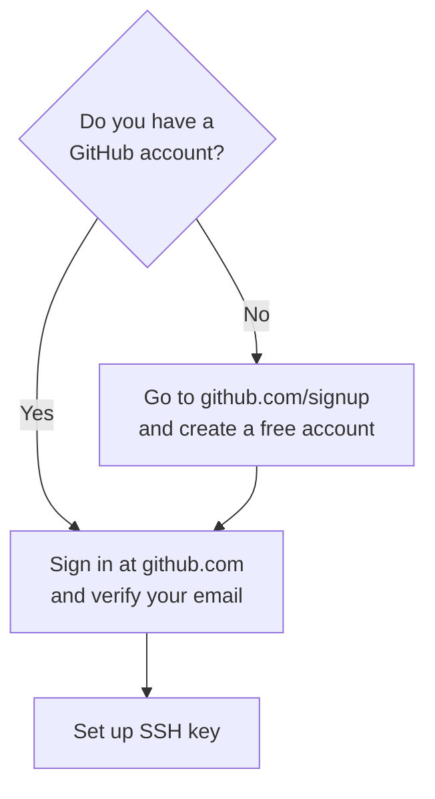

If you need to create an account, visit **https://github.com/signup** and follow the prompts.

### Step 3.4: Set Up SSH Key for GitHub

This lets you push code to GitHub without typing your password each time:

```bash
ssh-keygen -t ed25519 -C "russ@russ.net"
```

Press Enter three times to accept defaults (no passphrase for simplicity).

Display your public key:

```bash
cat ~/.ssh/id_ed25519.pub
```

Copy the entire output, then:

1. Go to **https://github.com/settings/keys**
2. Click **New SSH key**
3. Paste the key and give it a title like "WSL Ubuntu"
4. Click **Add SSH key**

Test the connection:

```bash
ssh -T git@github.com
```

You should see: *"Hi Russ! You've successfully authenticated..."*

### Step 3.5: Install Azure CLI (Inside WSL)

```bash
curl -sL https://aka.ms/InstallAzureCLIDeb | sudo bash
az --version
```

Log in to Azure:

```bash
az login
```

A browser window opens — sign in with your Azure account. If you don't have one, create a free account at **https://azure.microsoft.com/free**.

### Step 3.6: Install GitHub CLI (Inside WSL)

```bash
sudo apt install gh -y
gh auth login
```

Follow the interactive prompts — choose **GitHub.com**, **SSH**, and authenticate via browser.

### Checkpoint

```
You should now have:
[x] Node.js LTS installed via nvm
[x] Git installed and configured with your identity
[x] GitHub account created/verified
[x] SSH key added to GitHub
[x] Azure CLI installed and logged in
[x] GitHub CLI installed and authenticated
```

---

## Lab 4: Configure MCP Servers

MCP (Model Context Protocol) servers extend GitHub Copilot's capabilities by giving it access to external tools and services. Think of them as plugins that let Copilot reach beyond your code editor.

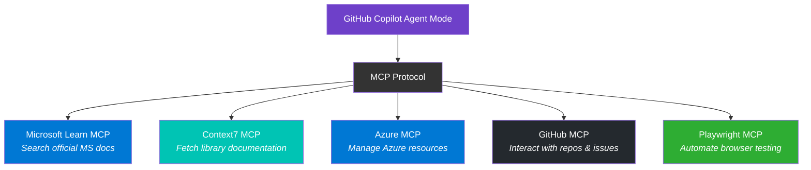

### What Each MCP Server Does

| MCP Server | Purpose |
|---|---|
| **Microsoft Learn** | Searches and fetches official Microsoft documentation and code samples so Copilot gives you answers grounded in current docs. |
| **Context7** | Delivers up-to-date, version-specific documentation for any library (React, Vite, Tailwind, etc.) directly into Copilot's context. |
| **Azure** | Enables Copilot to interact with your Azure resources — listing, creating, and managing cloud services through natural language. |
| **GitHub** | Gives Copilot access to your GitHub repositories, issues, pull requests, and code for context-aware development assistance. |
| **Playwright** | Allows Copilot to automate browser interactions for testing and web scraping through structured accessibility data. |

### Step 4.1: Create the MCP Configuration File

In your project workspace (you'll create the project in Lab 6, but set this up at the user level now), open VS Code settings:

Press `Ctrl+Shift+P` and type **Preferences: Open User Settings (JSON)**.

Add the following MCP configuration block inside the JSON object:

```json
{
  "mcp": {
    "servers": {
      "microsoft-learn": {
        "command": "npx",
        "args": ["-y", "@anthropic-ai/microsoft-learn-mcp@latest"]
      },
      "context7": {
        "command": "npx",
        "args": ["-y", "@upstash/context7-mcp"]
      },
      "azure": {
        "command": "npx",
        "args": ["-y", "@azure/mcp@latest", "server", "start"]
      },
      "github": {
        "command": "npx",
        "args": ["-y", "@modelcontextprotocol/server-github"],
        "env": {
          "GITHUB_TOKEN": "${input:github_token}"
        }
      },
      "playwright": {
        "command": "npx",
        "args": ["-y", "@playwright/mcp@latest"]
      }
    },
    "inputs": [
      {
        "id": "github_token",
        "type": "promptString",
        "description": "GitHub Personal Access Token",
        "password": true
      }
    ]
  }
}
```

### Step 4.2: Generate a GitHub Personal Access Token

The GitHub MCP server needs a token to access your repositories:

1. Go to **https://github.com/settings/tokens?type=beta**
2. Click **Generate new token**
3. Name it "VS Code Copilot MCP"
4. Set expiration to 90 days
5. Under **Repository access**, select "All repositories"
6. Under **Permissions**, enable: Contents (read), Issues (read/write), Pull Requests (read/write)
7. Click **Generate token** and copy it

When Copilot first uses the GitHub MCP server, VS Code will prompt you to paste this token.

### Step 4.3: Verify MCP Servers

Open the Command Palette (`Ctrl+Shift+P`) and run:

```
MCP: List Servers
```

You should see all five servers listed. Start each one by right-clicking and selecting **Start Server**.

Alternatively, you can view installed MCP servers in the Extensions panel:


*Scroll to the bottom of the Extensions panel to see the "MCP SERVERS - INSTALLED" section showing Azure MCP Server and Context7*

### Checkpoint

```
You should now have:
[x] All 5 MCP servers configured in VS Code settings
[x] GitHub personal access token created
[x] MCP servers visible and startable from Command Palette
```

---

## Lab 5: Set Up Copilot Customization Files

Copilot customization files tell the AI about your project, your standards, and your preferences. This is what separates productive vibe coding from random code generation.

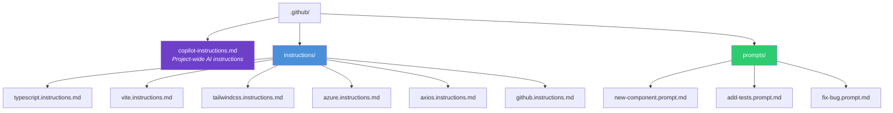

### Step 5.1: Create the Directory Structure

In your WSL terminal, navigate to where you'll create the project (Lab 6), then set up the structure:

```bash
mkdir -p my-vibe-app/.github/instructions
mkdir -p my-vibe-app/.github/prompts
cd my-vibe-app
git init
```

### Step 5.2: Create the Main Copilot Instructions File

Create `.github/copilot-instructions.md`:

```markdown
# Project: My Vibe App

## Overview
A modern web application built with Vite, React, TypeScript, and Tailwind CSS.
This project follows a component-based architecture deployed to Azure Static Web Apps.

## Tech Stack
- **Runtime**: Node.js 24 LTS
- **Framework**: React 19 with TypeScript 5.x
- **Build Tool**: Vite 6.x
- **Styling**: Tailwind CSS v4
- **HTTP Client**: Axios
- **Testing**: Vitest + React Testing Library
- **Deployment**: Azure Static Web Apps via GitHub Actions

## Project Structure
```
src/
  components/    # Reusable UI components (PascalCase filenames)
  pages/         # Route-level page components
  hooks/         # Custom React hooks (use- prefix)
  services/      # API service modules (Axios instances)
  types/         # Shared TypeScript interfaces and types
  utils/         # Pure utility functions
public/          # Static assets
```

## Build & Run Commands
- `npm install` — Install dependencies (always run first)
- `npm run dev` — Start Vite dev server on port 5173
- `npm run build` — Production build to dist/ directory
- `npm run preview` — Preview production build locally
- `npm run test` — Run Vitest test suite
- `npm run lint` — Run ESLint checks

## Coding Standards
- Use TypeScript strict mode — no `any` types
- Functional components only — no class components
- Named exports for components, default exports for pages
- All components must have Props interface defined
- Use Tailwind utility classes — never write custom CSS
- Handle all errors with try/catch and user-friendly messages
- Every new component needs a co-located test file

## Git Conventions
- Branch names: feature/, bugfix/, or chore/ prefix
- Commit messages: imperative mood, under 72 characters
- Always create pull requests — never push directly to main
```

### Step 5.3: Create Path-Specific Instruction Files

These files apply only to files matching their glob patterns, giving Copilot targeted guidance per technology.

**`.github/instructions/typescript.instructions.md`**:

```markdown
---
applyTo: "**/*.ts,**/*.tsx"
description: "TypeScript coding standards and patterns"
---

# TypeScript Standards

- Enable strict mode in tsconfig.json — never disable it
- Use explicit return types on all exported functions
- Prefer `interface` over `type` for object shapes
- Use `unknown` instead of `any` — add type guards to narrow
- Apply utility types: `Partial<T>`, `Pick<T, K>`, `Omit<T, K>`, `Record<K, V>`
- Use `as const` assertions for literal values
- Define enums as `const enum` or union string literals
- Handle null/undefined with optional chaining (?.) and nullish coalescing (??)

## Naming Conventions
- Interfaces: PascalCase with descriptive names (UserProfile, not IUser)
- Type aliases: PascalCase (ApiResponse, ButtonVariant)
- Variables and functions: camelCase
- Constants: UPPER_SNAKE_CASE for true constants, camelCase for derived values
- Generic type parameters: T, K, V or descriptive (TItem, TResponse)

## Import Organization
1. React and framework imports
2. Third-party library imports
3. Local component imports
4. Local utility/hook imports
5. Type imports (use `import type` syntax)
```

**`.github/instructions/vite.instructions.md`**:

```markdown
---
applyTo: "vite.config.*,**/*.config.ts,**/*.config.js"
description: "Vite configuration and build patterns"
---

# Vite Configuration

- Use the @vitejs/plugin-react plugin for React support
- Configure path aliases in both vite.config.ts and tsconfig.json
- Set build.outDir to "dist"
- Enable source maps in development only
- Use environment variables with the VITE_ prefix exclusively
- Access env vars via import.meta.env.VITE_VARIABLE_NAME
- Never expose secrets in VITE_ variables — they are embedded in the client bundle
- Configure proxy in server.proxy for API calls during development
```

**`.github/instructions/tailwindcss.instructions.md`**:

```markdown
---
applyTo: "**/*.tsx,**/*.jsx,**/*.css"
description: "Tailwind CSS styling conventions"
---

# Tailwind CSS Standards

- Apply utility-first classes directly on JSX elements
- Never write custom CSS files for component styling
- Use responsive prefixes in mobile-first order: sm:, md:, lg:, xl:, 2xl:
- Group related utilities: layout, spacing, typography, colors, effects
- Use Tailwind's color palette — avoid arbitrary hex values
- Combine hover:, focus:, and active: state variants as needed
- For repeated patterns, extract into React components — not CSS classes
- Use the cn() helper (clsx + tailwind-merge) for conditional classes
- Dark mode: use the dark: variant prefix

## Component Patterns
- Buttons: include padding, rounded corners, transition, hover/focus states
- Cards: use rounded-lg, shadow, p-6 as base pattern
- Forms: consistent ring focus states with focus:ring-2 focus:ring-blue-500
```

**`.github/instructions/azure.instructions.md`**:

```markdown
---
applyTo: "**/*azure*,**/*.bicep,**/staticwebapp*,**/*deploy*"
description: "Azure deployment and infrastructure patterns"
---

# Azure Standards

- Deploy frontend to Azure Static Web Apps (free tier available)
- Use managed identity for service authentication when possible
- Store secrets in Azure Key Vault — never in code or config files
- Tag all resources with: environment, project, owner
- Use Bicep templates for infrastructure-as-code
- Follow naming convention: {project}-{resource}-{environment}
  Example: myvibeapp-swa-prod

## Static Web Apps Configuration
- Place staticwebapp.config.json in project root
- Define route fallback to index.html for SPA routing
- Configure API routes if using Azure Functions backend
- Set platform.apiRuntime to "node:24" for serverless functions
```

**`.github/instructions/axios.instructions.md`**:

```markdown
---
applyTo: "**/services/**,**/api/**,**/*service*,**/*api*"
description: "Axios HTTP client patterns"
---

# Axios Patterns

- Create a shared Axios instance with baseURL and default headers
- Use interceptors for authentication token injection
- Use interceptors for global error handling and retry logic
- Define response types with TypeScript generics: axios.get<UserProfile>(url)
- Always handle errors in try/catch blocks with typed error responses
- Set reasonable timeouts (10s default, 30s for file uploads)
- Use AbortController for cancellable requests

## Service Module Template
```typescript
import axios from 'axios';

const api = axios.create({
  baseURL: import.meta.env.VITE_API_URL,
  timeout: 10000,
  headers: { 'Content-Type': 'application/json' }
});

api.interceptors.response.use(
  response => response,
  error => {
    // centralized error handling
    return Promise.reject(error);
  }
);

export default api;
```
```

**`.github/instructions/github.instructions.md`**:

```markdown
---
applyTo: ".github/**,**/*.yml,**/*.yaml"
description: "GitHub workflows and repository conventions"
---

# GitHub Conventions

- Use GitHub Actions for all CI/CD pipelines
- Workflow files live in .github/workflows/
- Protect the main branch — require pull request reviews
- Use semantic PR titles: feat:, fix:, chore:, docs:
- Add CODEOWNERS file to auto-assign reviewers
- Use GitHub Issues for task tracking with labels

## Workflow Standards
- Pin action versions to specific SHA or major version
- Cache node_modules with actions/cache for faster builds
- Run lint, type-check, and tests before deployment
- Use environment secrets — never hardcode credentials
- Gate production deployments behind environment approvals
```

### Step 5.4: Create Reusable Prompt Files

These are shortcuts you can invoke in Copilot Chat by typing `/promptname`.

**`.github/prompts/new-component.prompt.md`**:

```markdown
Create a new React component with the following requirements:
- Functional component with TypeScript
- Define a Props interface with all props documented via JSDoc
- Use Tailwind CSS for all styling
- Include proper accessibility attributes (aria-labels, roles)
- Export as a named export
- Include a co-located test file using Vitest and React Testing Library
```

**`.github/prompts/add-tests.prompt.md`**:

```markdown
Write tests for the specified component or function:
- Use Vitest as the test runner
- Use React Testing Library for component tests
- Test user interactions with userEvent (not fireEvent)
- Test both happy path and error states
- Mock external dependencies with vi.mock()
- Aim for meaningful assertions, not just snapshot tests
```

**`.github/prompts/fix-bug.prompt.md`**:

```markdown
Investigate and fix the described bug:
1. Identify the root cause — explain what is happening and why
2. Propose the minimal fix that resolves the issue
3. Check for similar patterns elsewhere that might have the same bug
4. Add or update tests to prevent regression
5. Explain what changed and why the fix works
```

### Checkpoint

```
You should now have:
[x] .github/copilot-instructions.md — project-wide AI context
[x] 6 path-specific .instructions.md files (TypeScript, Vite, Tailwind, Azure, Axios, GitHub)
[x] 3 reusable prompt files (new-component, add-tests, fix-bug)
[x] All files committed to your git repo
```

---

## Lab 6: Vibe Code Your First Project

This is where it all comes together. You'll use Copilot Agent Mode to build a real application through conversation instead of manual coding.

### The Vibe Coding Workflow

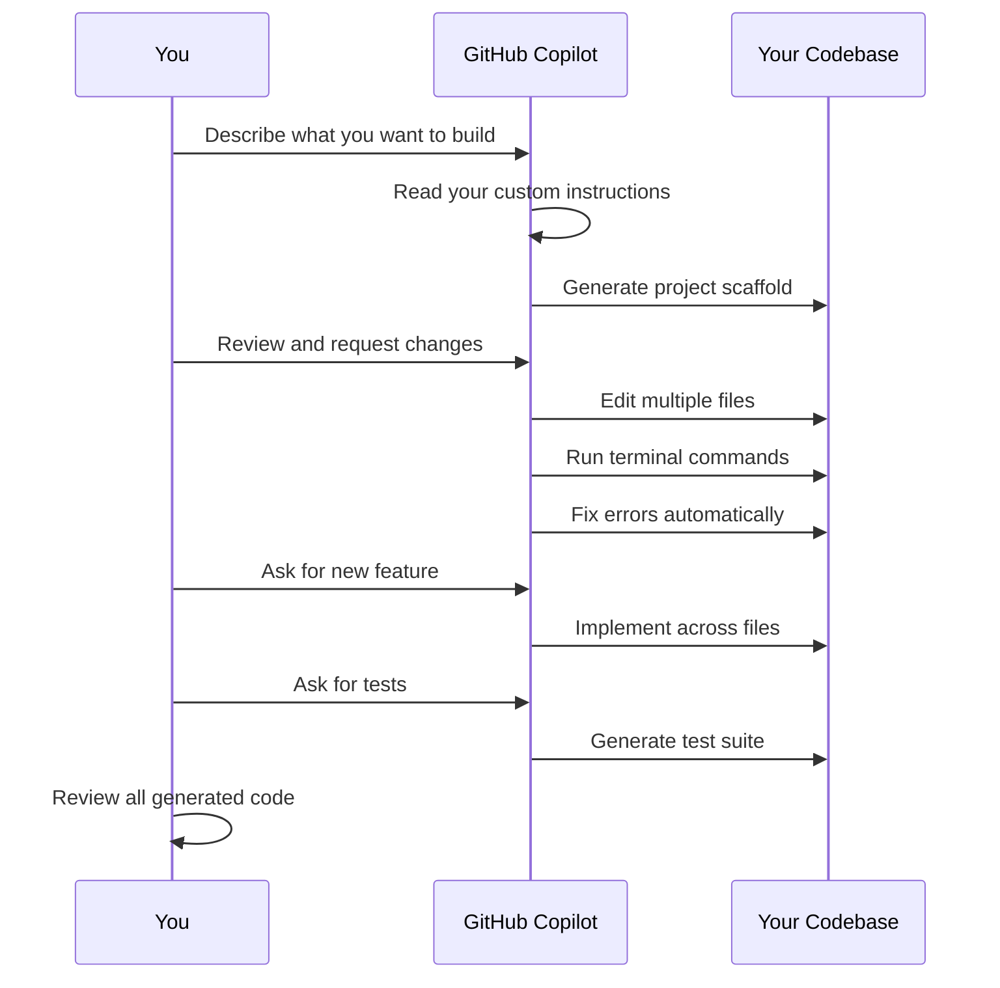

### Step 6.1: Scaffold the Project with Vite

In your WSL terminal, inside the `my-vibe-app` directory:

```bash
npm create vite@latest . -- --template react-ts
npm install
npm install -D tailwindcss @tailwindcss/vite
npm install -D vitest @testing-library/react @testing-library/jest-dom @testing-library/user-event jsdom
npm install axios
```

> **What these do**: `vitest` is the test runner, `@testing-library/*` provides utilities to test React components the way users interact with them, and `jsdom` simulates a browser environment for tests.

### Step 6.2: Configure Tailwind CSS v4

Open `vite.config.ts` and update it:

```typescript
import { defineConfig } from 'vite'
import react from '@vitejs/plugin-react'
import tailwindcss from '@tailwindcss/vite'

export default defineConfig({
  plugins: [
    react(),
    tailwindcss(),
  ],
})
```

Replace the contents of `src/index.css` with:

```css
@import "tailwindcss";
```

### Step 6.3: Verify the Setup

```bash
npm run dev
```

Open `http://localhost:5173` in your browser. You should see the Vite + React starter page.

### Step 6.3b: Set Up Environment Variables

Create a `.env` file for local configuration and a `.env.example` file to document what's needed:

```bash
# .env.example (commit this — it documents required variables)
VITE_API_URL=https://your-api-url.com
VITE_APP_TITLE=My Vibe App
```

```bash
# .env (never commit this — it contains actual values)
VITE_API_URL=https://jsonplaceholder.typicode.com
VITE_APP_TITLE=My Vibe App
```

Add `.env` to your `.gitignore` to keep secrets out of your repository:

```bash
echo ".env" >> .gitignore
echo ".env.local" >> .gitignore
```

> **Important**: In Vite, only variables prefixed with `VITE_` are exposed to your app. Access them with `import.meta.env.VITE_VARIABLE_NAME`. Never put API keys or passwords in `VITE_` variables — they get embedded in the browser bundle where anyone can see them.

### Step 6.4: Start Vibe Coding with Agent Mode

Open Copilot Chat in VS Code (`Ctrl+Shift+I`). Switch to **Agent Mode** using the dropdown at the top of the chat panel.

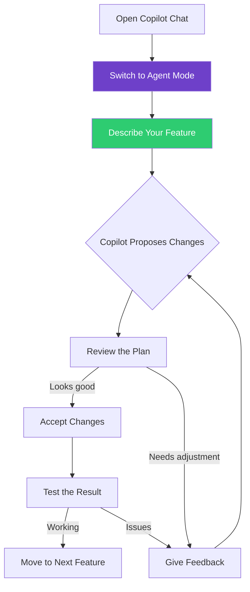

Try this as your first prompt:

> Build me a dashboard page with a header showing "My Vibe App", a sidebar navigation with links to Home, About, and Settings pages, and a main content area that displays a welcome card with today's date. Use Tailwind CSS for all styling. Make it responsive — sidebar should collapse to a hamburger menu on mobile.

Watch as Copilot:
- Reads your `.github/copilot-instructions.md` for context
- Creates multiple component files following your TypeScript standards
- Applies Tailwind classes matching your styling conventions
- Runs build commands to verify everything compiles

### Step 6.5: Iterate with Conversation

Continue building features through natural language:

> "Add an API service using Axios that fetches posts from jsonplaceholder.typicode.com/posts and display them as cards on the Home page."

> "Add a dark mode toggle in the header that persists the user's preference."

> "Write tests for the Dashboard and Home page components."

### Key Vibe Coding Principles

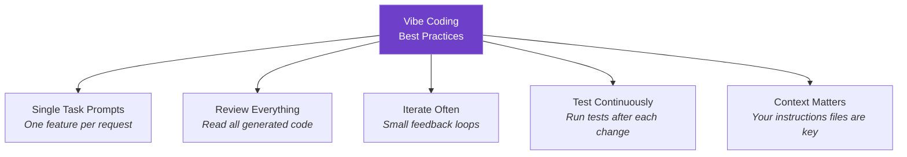

1. **One task per prompt** — Don't ask for five features at once
2. **Read every line Copilot generates** — You're the architect, not just the requester
3. **Give specific feedback** — "The button should be blue-500, not blue-700" is better than "fix the button"
4. **Run your app constantly** — Check the browser after each change
5. **Commit often** — Small, frequent commits let you roll back safely

### Step 6.6: Troubleshooting Errors with Copilot Chat

When you run `npm run build` or `npm run dev` and encounter errors, Copilot Chat is your debugging assistant. The process is simple:

**The Error-to-Fix Workflow**:

1. **See the error** — Terminal shows red error messages with file paths and line numbers
2. **Copy the error text** — Select and copy the entire error output (Ctrl+C)
3. **Open Copilot Chat** — Press `Ctrl+Shift+I` if not already open
4. **Paste and send** — Just paste the error (Ctrl+V) and press Enter
5. **Review the fix** — Copilot analyzes your codebase and suggests changes
6. **Keep or Undo** — Click "Keep" to apply the fix, or "Undo" to try again


*Example: TypeScript build errors in the terminal — copy this entire output*


*Copilot shows exactly what it will change before applying the fix*

**Important**: You don't need to add extra context or explain the error. Copilot already has access to your entire project, custom instructions, and the files involved. Just paste the raw error text.

**Common Errors Copilot Can Fix**:
- **TypeScript type mismatches** — "Type 'string' is not assignable to type 'number'"
- **Missing imports** — "Cannot find module 'react'"
- **Syntax errors** — Missing brackets, incorrect JSX, typos
- **Build configuration issues** — vite.config.ts problems, tsconfig.json issues
- **Dependency conflicts** — Version mismatches or missing packages
- **Runtime errors** — Null references, undefined variables, prop type errors

**Pro Tip**: If Copilot's first suggestion doesn't work, paste the *new* error message and it will iterate toward a solution.

### Checkpoint

```
You should now have:
[x] Vite + React + TypeScript project scaffolded
[x] Tailwind CSS v4 configured
[x] Multiple components built via Copilot Agent Mode
[x] Tests generated for your components
[x] A working app on localhost:5173
```

---

## Lab 7: Deploy to Azure Static Web Apps

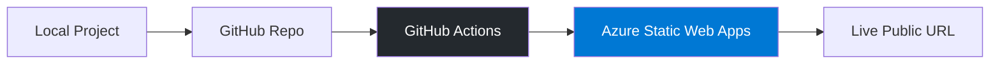

### Step 7.1: Create a GitHub Repository

```bash
gh repo create my-vibe-app --public --source=. --push
```

This creates the repo on GitHub and pushes your code in one command.

### Step 7.2: Create an Azure Static Web App

Use the Azure CLI:

```bash
az staticwebapp create \
  --name my-vibe-app \
  --resource-group myResourceGroup \
  --source https://github.com/YOUR_USERNAME/my-vibe-app \
  --location "eastus2" \
  --branch main \
  --app-location "/" \
  --output-location "dist" \
  --login-with-github
```

> **Note**: Replace `YOUR_USERNAME` with your GitHub username. If you don't have a resource group yet, create one first:
> ```bash
> az group create --name myResourceGroup --location eastus2
> ```

### Step 7.2b: Create the SPA Routing Config

Create `staticwebapp.config.json` in your project root so that client-side routing works correctly:

```json
{
  "navigationFallback": {
    "rewrite": "/index.html",
    "exclude": ["/assets/*", "/*.svg", "/*.png", "/*.ico"]
  },
  "platform": {
    "apiRuntime": "node:24"
  }
}
```

Commit and push this file:

```bash
git add staticwebapp.config.json
git commit -m "Add Azure Static Web Apps routing config"
git push
```

### Step 7.3: Verify Deployment

After a few minutes, check your deployment:

```bash
az staticwebapp show --name my-vibe-app --resource-group myResourceGroup --query "defaultHostname" -o tsv
```

Open the URL in your browser. Your vibe-coded app is now live.

### Checkpoint

```
You should now have:
[x] Code pushed to GitHub repository
[x] Azure Static Web App created
[x] App deployed and accessible via public URL
```

---

## Lab 8: Set Up CI/CD with GitHub Actions

Azure Static Web Apps auto-generates a GitHub Actions workflow during creation, but let's review and enhance it.

### Step 8.1: Review the Auto-Generated Workflow

Check `.github/workflows/` for a file named something like `azure-static-web-apps-*.yml`. Open it and review the build configuration.

### Step 8.2: Add Quality Gates

Ask Copilot to help you enhance the workflow:

> "Update my GitHub Actions workflow to run linting and tests before the Azure deployment step. If lint or tests fail, the deployment should not proceed."

The enhanced workflow should include steps like:

```yaml
- name: Install dependencies
  run: npm ci

- name: Run linter
  run: npm run lint

- name: Run type check
  run: npx tsc --noEmit

- name: Run tests
  run: npm run test -- --run

- name: Build
  run: npm run build
```

### Step 8.3: Protect the Main Branch

On GitHub, go to your repository Settings > Branches > Add branch protection rule:

- Branch name pattern: `main`
- [x] Require a pull request before merging
- [x] Require status checks to pass before merging
- Select your build/test workflow as a required check

### CI/CD Flow

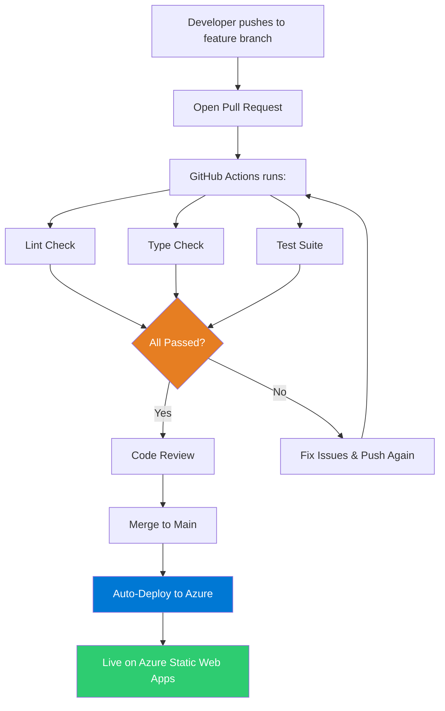

### Checkpoint

```
You should now have:
[x] GitHub Actions workflow with lint, type-check, and test gates
[x] Branch protection enabled on main
[x] Auto-deployment on merge to main
```

---

## Lab 9 (Optional): Publish as a Power Apps Code App

Power Apps **code apps** are a newer capability that lets you take a standard web app built with frameworks like React/Vite/TypeScript and publish it directly to the Power Platform as a managed business application. Unlike PCF components (which are individual controls embedded in existing Power Apps), code apps are full standalone applications that run inside the Power Platform with enterprise features like Entra authentication, Data Loss Prevention, Conditional Access, and access to 1,500+ Power Platform connectors.

```mermaid
graph LR
    VA[Your Vite + React App] --> SDK[@microsoft/power-apps SDK]
    SDK --> PAC[pac code push]
    PAC --> PP[Power Platform Environment]
    PP --> USERS[Shared with Users]
    PP --> CONN[1,500+ Connectors]
    PP --> GOV[Enterprise Governance]

    style VA fill:#2ECC71,color:#fff
    style PP fill:#742774,color:#fff
    style GOV fill:#0078D4,color:#fff
```

### How Code Apps Differ from PCF Components

| | Code Apps | PCF Components |
|---|---|---|
| **What you build** | A full standalone web app | A single reusable UI control |
| **Framework** | Any SPA framework (React, Vue, etc.) | Must follow PCF API contract |
| **Runs as** | Its own app in Power Platform | Embedded inside a canvas or model-driven app |
| **Data access** | Power Platform connectors via SDK | Component framework `context.parameters` |
| **Deployment** | `pac code push` | `pac pcf push` into a Dataverse solution |

### Code App Architecture

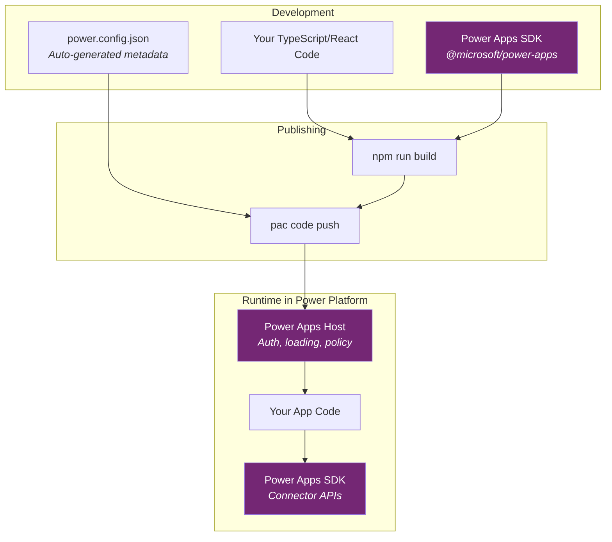

### Prerequisites

- A **Power Platform environment with code apps enabled** (an admin must toggle this on — see Step 9.2)
- A **Power Apps Premium license** for end users who will run the app
- Node.js and Git (already installed from Lab 1 and 3)
- The **Power Platform CLI** (`pac`)

### Step 9.1: Install the Power Platform CLI

Install the Power Platform CLI (also called PAC CLI) inside WSL:

```bash
dotnet tool install --global Microsoft.PowerApps.CLI.Tool
```

> **Note**: This requires the .NET SDK. If you don't have it:
> ```bash
> sudo apt install -y dotnet-sdk-8.0
> ```

Verify the installation:

```bash
pac --version
```

Alternatively, install the **Power Platform Tools** extension in VS Code, which includes the PAC CLI.

### Step 9.2: Enable Code Apps on Your Environment

A Power Platform admin must enable the feature:

1. Go to the **Power Platform admin center** at https://admin.powerplatform.microsoft.com
2. Navigate to **Manage** > **Environments** > select your environment
3. Go to **Settings** > expand **Product** > select **Features**
4. Find **Power Apps code apps** and toggle **Enable code apps** to **On**
5. Click **Save**

### Step 9.3: Authenticate and Select Your Environment

```bash
pac auth create
```

Sign in with your Power Platform account when the browser opens. Then select your target environment:

```bash
pac env select --environment <Your-Environment-ID>
```

> **Tip**: Run `pac env list` to see all available environments and their IDs.

### Step 9.4: Initialize Your Vite Project as a Code App

You can turn your existing Vite + React + TypeScript project into a code app. From inside your `my-vibe-app` project directory:

```bash
npm install @microsoft/power-apps
pac code init --displayname "My Vibe App"
```

This does two things:
- Installs the **Power Apps SDK** (`@microsoft/power-apps`), which provides authentication and connector APIs
- Creates a `power.config.json` file that the PAC CLI uses for publishing metadata

### Step 9.5: Connect to a Data Source (Example: Office 365 Users)

First, make sure you have a connection set up in Power Apps:

1. Go to https://make.powerapps.com
2. Navigate to **Connections** in the left menu
3. Click **+ New connection** and create an **Office 365 Users** connection (or use an existing one)

Get your connection metadata:

```bash
pac connection list
```

This shows a table with **Connection ID** and **API Name**. Copy both values for the Office 365 Users connection, then add it to your code app:

```bash
pac code add-data-source -a "shared_office365users" -c "<your-connection-id>"
```

The CLI automatically generates typed TypeScript model and service files in `src/generated/`:
- `Office365UsersModel.ts` — TypeScript interfaces for request/response objects
- `Office365UsersService.ts` — Methods to call the connector

### Step 9.6: Use the Generated Service in Your App

Import and call the generated service in your React code:

```typescript
import { Office365UsersService } from './generated/services/Office365UsersService';
import type { User } from './generated/models/Office365UsersModel';

// Inside a React component:
const [user, setUser] = useState<User | null>(null);

useEffect(() => {
  const loadProfile = async () => {
    const profile = (
      await Office365UsersService.MyProfile_V2("id,displayName,jobTitle,userPrincipalName")
    ).data;
    setUser(profile);
  };
  loadProfile();
}, []);
```

> **Note**: You can also use Copilot Agent Mode to help you integrate the generated services — just ask it to wire up the data source after you run `pac code add-data-source`.

### Step 9.7: Test Locally

```bash
npm run dev
```

Open the **Local Play** URL that appears in the terminal output. Open it in the same browser profile where you're signed in to your Power Platform tenant.

> **Browser Note**: Since December 2025, Chrome and Edge block requests from public origins to localhost by default. You may need to grant local network access permission when prompted.

### Step 9.8: Build and Publish to Power Platform

When everything works locally, publish with a single command:

```bash
npm run build | pac code push
```

This builds your Vite project and publishes the compiled output to your Power Platform environment. The command returns a **Power Apps URL** where you can run the app.

You can also find your app at https://make.powerapps.com — it appears alongside your other Power Apps, where you can play, share, or manage it.

### Step 9.9: Share Your App

1. Go to https://make.powerapps.com
2. Find your app in the **Apps** list
3. Click the **...** menu > **Share**
4. Add users or security groups
5. Assign permissions (User or Co-owner)

Your app now runs as a managed Power Platform application with Entra single sign-on, DLP policy enforcement, and admin governance — all from the same TypeScript/React codebase you built in Labs 1-8.

### Checkpoint

```
You should now have:
[x] Power Platform CLI installed and authenticated
[x] Code apps enabled on your environment
[x] Power Apps SDK installed in your project
[x] Data source connected with auto-generated TypeScript models
[x] App tested locally with Local Play
[x] App published to Power Platform via pac code push
[x] App shareable with users at make.powerapps.com
```

---

## Quick Reference Card

### Copilot Chat Shortcuts

| Shortcut | Action |
|---|---|
| `Ctrl+Shift+I` | Open Copilot Chat |
| `Ctrl+I` | Inline Copilot (edit in place) |
| `/new-component` | Run your custom prompt file |
| `/add-tests` | Run your test generation prompt |
| `/fix-bug` | Run your bug investigation prompt |
| `@workspace` | Give Copilot your full project context |

### Key File Locations

| File | Purpose |
|---|---|
| `.github/copilot-instructions.md` | Project-wide AI context |
| `.github/instructions/*.instructions.md` | Technology-specific rules |
| `.github/prompts/*.prompt.md` | Reusable prompt shortcuts |
| `.vscode/settings.json` | MCP server configuration |
| `vite.config.ts` | Build configuration |
| `staticwebapp.config.json` | Azure SWA routing |

### Essential Terminal Commands

```bash
npm run dev          # Start dev server
npm run build        # Production build
npm run test         # Run tests
npm run lint         # Check code quality
az login             # Authenticate with Azure
gh repo create       # Create GitHub repo
gh pr create         # Create pull request
```

---

## What You Built Today

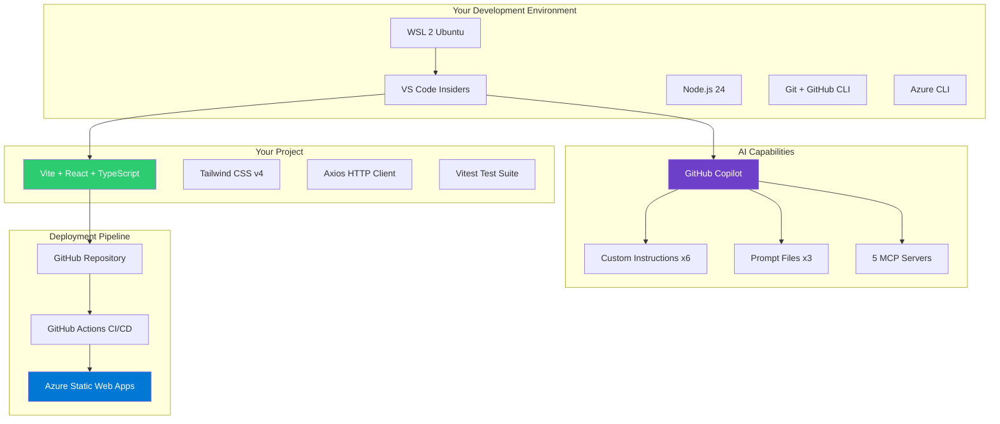

---

## Next Steps

After completing this lab, continue building your skills by:

- **Exploring the awesome-copilot repo** at https://github.com/github/awesome-copilot for more instruction templates, agents, and skills you can add to your project
- **Adding more MCP servers** as needed for your workflow (database, Docker, Figma, etc.)
- **Creating custom Copilot skills** in `.github/skills/` for automated workflows specific to your team
- **Setting up Copilot coding agent** (GitHub's cloud-based agent that can work on issues assigned to it autonomously)
- **Building with the Azure MCP** to create and manage cloud resources entirely through conversation

---

*Lab created February 2026. Based on GitHub Copilot customization patterns from the [awesome-copilot](https://github.com/github/awesome-copilot) repository and current Microsoft documentation.*
